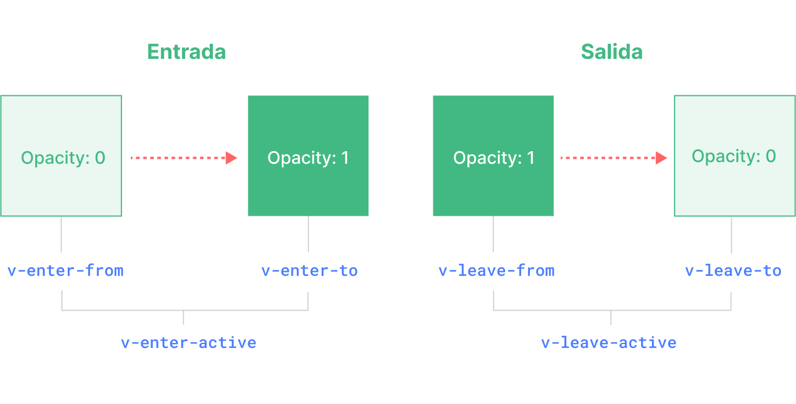

<script setup>
import Basic from './transition-demos/Basic.vue'
import SlideFade from './transition-demos/SlideFade.vue'
import CssAnimation from './transition-demos/CssAnimation.vue'
import NestedTransitions from './transition-demos/NestedTransitions.vue'
import JsHooks from './transition-demos/JsHooks.vue'
import BetweenElements from './transition-demos/BetweenElements.vue'
import BetweenComponents from './transition-demos/BetweenComponents.vue'
</script>

# Transition {#transition}

Vue ofrece dos componentes incorporados que pueden ayudar a trabajar con transiciones y animaciones en respuesta al cambio de estado:

- `<Transition>` para aplicar animaciones cuando un elemento o componente está entrando y saliendo del DOM. Esto se cubre en esta página.

- `<TransitionGroup>` para aplicar animaciones cuando un elemento o componente es insertado, eliminado o movido dentro de una lista `v-for`. Esto se cubre en [el próximo capítulo](/guide/built-ins/transition-group).

Aparte de estos dos componentes, también podemos aplicar animaciones en Vue utilizando otras técnicas como la alternancia de clases CSS o animaciones impulsadas por el estado a través de enlaces de estilo. Estas técnicas adicionales se cubren en el capítulo [Técnicas de Animación](/guide/extras/animation).

## El componente `<Transition>` {#the-transition-component}

`<Transition>` es un componente incorporado: esto significa que está disponible en la plantilla de cualquier componente sin necesidad de registrarlo. Se puede usar para aplicar animaciones de entrada y salida en elementos o componentes que se le pasan a través de su slot predeterminado. La entrada o salida puede ser desencadenada por uno de los siguientes:

- Renderizado condicional a través de `v-if`
- Visualización condicional a través de `v-show`
- Alternancia de componentes dinámicos a través del elemento especial `<component>`
- Cambio del atributo especial `key`

Este es un ejemplo del uso más básico:

```vue-html
<button @click="show = !show">Toggle</button>
<Transition>
  <p v-if="show">hello</p>
</Transition>
```

```css
/* we will explain what these classes do next! */
.v-enter-active,
.v-leave-active {
  transition: opacity 0.5s ease;
}

.v-enter-from,
.v-leave-to {
  opacity: 0;
}
```

<Basic />

<div class="composition-api">

[Pruébalo en el Playground](https://play.vuejs.org/#eNpVkEFuwyAQRa8yZZNWqu1sunFJ1N4hSzYUjRNUDAjGVJHluxcCipIV/OG/pxEr+/a+TwuykfGogvYEEWnxR2H17F0gWCHgBBtMwc2wy9WdsMIqZ2OuXtwfHErhlcKCb8LyoVoynwPh7I0kzAmA/yxEzsKXMlr9HgRr9Es5BTue3PlskA+1VpFTkDZq0i3niYfU6anRmbqgMY4PZeH8OjwBfHhYIMdIV1OuferQEoZOKtIJ328TgzJhm8BabHR3jeC8VJqusO8/IqCM+CnsVqR3V/mfRxO5amnkCPuK5B+6rcG2/fydshks=)

</div>
<div class="options-api">

[Pruébalo en el Playground](https://play.vuejs.org/#eNpVkMFuAiEQhl9lyqlNuouXXrZo2nfwuBeKs0qKQGBAjfHdZZfVrAmB+f/M/2WGK/v1vs0JWcdEVEF72vQWz94Fgh0OMhmCa28BdpLk+0etAQJSCvahAOLBnTqgkLA6t/EpVzmCP7lFEB69kYRFAYi/ROQs/Cij1f+6ZyMG1vA2vj3bbN1+b1Dw2lYj2yBt1KRnXRwPudHDnC6pAxrjBPe1n78EBF8MUGSkSxlLNjdoCUMjFemMn5NjUGacnboqPVkdOC+Vpgus2q8IKCN+T+suWENwxyWJXKXMyQ5WNVJ+aBqD3e6VSYoi)

</div>

:::tip
`<Transition>` solo soporta un único elemento o componente como contenido de su slot. Si el contenido es un componente, el componente también debe tener un único elemento raíz.
:::

Cuando un elemento en un componente `<Transition>` es insertado o eliminado, ocurre lo siguiente:

1.  Vue detectará automáticamente si el elemento objetivo tiene transiciones o animaciones CSS aplicadas. Si las tiene, un número de [clases de transición CSS](#transition-classes) se añadirán/eliminarán en los momentos apropiados.

2.  Si hay escuchadores para [hooks de JavaScript](#javascript-hooks), estos hooks serán llamados en los momentos apropiados.

3.  Si no se detectan transiciones / animaciones CSS y no se proporcionan hooks de JavaScript, las operaciones del DOM para la inserción y/o eliminación se ejecutarán en el siguiente frame de animación del navegador.

## Transiciones basadas en CSS {#css-based-transitions}

### Clases de Transición {#transition-classes}

Hay seis clases aplicadas para las transiciones de entrada / salida.



<!-- https://www.figma.com/file/rlOv0ZKJFFNA9hYmzdZv3S/Transition-Classes -->

1.  `v-enter-from`: Estado inicial para la entrada. Añadida antes de que el elemento sea insertado, eliminada un frame después de que el elemento sea insertado.

2.  `v-enter-active`: Estado activo para la entrada. Aplicada durante toda la fase de entrada. Añadida antes de que el elemento sea insertado, eliminada cuando la transición/animación finaliza. Esta clase se puede usar para definir la duración, el retardo y la curva de aceleración para la transición de entrada.

3.  `v-enter-to`: Estado final para la entrada. Añadida un frame después de que el elemento sea insertado (al mismo tiempo que `v-enter-from` es eliminada), eliminada cuando la transición/animación finaliza.

4.  `v-leave-from`: Estado inicial para la salida. Añadida inmediatamente cuando se dispara una transición de salida, eliminada después de un frame.

5.  `v-leave-active`: Estado activo para la salida. Aplicada durante toda la fase de salida. Añadida inmediatamente cuando se dispara una transición de salida, eliminada cuando la transición/animación finaliza. Esta clase se puede usar para definir la duración, el retardo y la curva de aceleración para la transición de salida.

6.  `v-leave-to`: Estado final para la salida. Añadida un frame después de que se dispara una transición de salida (al mismo tiempo que `v-leave-from` es eliminada), eliminada cuando la transición/animación finaliza.

`v-enter-active` y `v-leave-active` nos dan la capacidad de especificar diferentes curvas de aceleración para las transiciones de entrada / salida, de las cuales veremos un ejemplo en las siguientes secciones.

### Transiciones Nombradas {#named-transitions}

Una transición se puede nombrar a través de la prop `name`:

```vue-html
<Transition name="fade">
  ...
</Transition>
```

Para una transición nombrada, sus clases de transición se prefijarán con su nombre en lugar de `v`. Por ejemplo, la clase aplicada para la transición anterior será `fade-enter-active` en lugar de `v-enter-active`. El CSS para la transición de fundido debería verse así:

```css
.fade-enter-active,
.fade-leave-active {
  transition: opacity 0.5s ease;
}

.fade-enter-from,
.fade-leave-to {
  opacity: 0;
}
```

### Transiciones CSS {#css-transitions}

`<Transition>` se usa más comúnmente en combinación con [transiciones CSS nativas](https://developer.mozilla.org/en-US/docs/Web/CSS/CSS_Transitions/Using_CSS_transitions), como se vio en el ejemplo básico anterior. La propiedad CSS `transition` es una abreviatura que nos permite especificar múltiples aspectos de una transición, incluyendo las propiedades que deben animarse, la duración de la transición y las [curvas de aceleración](https://developer.mozilla.org/en-US/docs/Web/CSS/easing-function).

Aquí hay un ejemplo más avanzado que transiciona múltiples propiedades, con diferentes duraciones y curvas de aceleración para entrada y salida:

```vue-html
<Transition name="slide-fade">
  <p v-if="show">hello</p>
</Transition>
```

```css
/*
  Enter and leave animations can use different
  durations and timing functions.
*/
.slide-fade-enter-active {
  transition: all 0.3s ease-out;
}

.slide-fade-leave-active {
  transition: all 0.8s cubic-bezier(1, 0.5, 0.8, 1);
}

.slide-fade-enter-from,
.slide-fade-leave-to {
  transform: translateX(20px);
  opacity: 0;
}
```

<SlideFade />

<div class="composition-api">

[Pruébalo en el Playground](https://play.vuejs.org/#eNqFkc9uwjAMxl/F6wXQKIVNk1AX0HbZC4zDDr2E4EK0NIkStxtDvPviFQ0OSFzyx/m+n+34kL16P+lazMpMRBW0J4hIrV9WVjfeBYIDBKzhCHVwDQySdFDZyipnY5Lu3BcsWDCk0OKosqLoKcmfLoSNN5KQbyTWLZGz8KKMVp+LKju573ivsuXKbbcG4d3oDcI9vMkNiqL3JD+AWAVpoyadGFY2yATW5nVSJj9rkspDl+v6hE/hHRrjRMEdpdfiDEkBUVxWaEWkveHj5AzO0RKGXCpSHcKBIfSPKEEaA9PJYwSUEXPX0nNlj8y6RBiUHd5AzCOodq1VvsYfjWE4GqfgEy/zMcxG17B9ZTyX8bV85C5y1S40ZX/kdj+GD1P/zVQA56XStC9h2idJI/z7huz4CxoVvE4=)

</div>
<div class="options-api">

[Pruébalo en el Playground](https://play.vuejs.org/#eNqFkc1uwjAMgF/F6wk0SmHTJNQFtF32AuOwQy+hdSFamkSJ08EQ776EbMAkJKTIf7I/O/Y+ezVm3HvMyoy52gpDi0rh1mhL0GDLvSTYVwqg4cQHw2QDWCRv1Z8H4Db6qwSyHlPkEFUQ4bHixA0OYWckJ4wesZUn0gpeainqz3mVRQzM4S7qKlss9XotEd6laBDu4Y03yIpUE+oB2NJy5QSJwFC8w0iIuXkbMkN9moUZ6HPR/uJDeINSalaYxCjOkBBgxeWEijnayWiOz+AcFaHNeU2ix7QCOiFK4FLCZPzoACnHXt6Pq7hP0Ii7/EGYuag9itR5yv8FmgH01EIPkUxG8F0eA2bJmut7kbX+pG+6NVq28WTBTN+92PwMDHbSAXQhteCdiVMUpNwwuMassMP8kfAJQ==)

</div>

### Animaciones CSS {#css-animations}

Las [animaciones CSS nativas](https://developer.mozilla.org/en-US/docs/Web/CSS/CSS_Animations/Using_CSS_animations) se aplican de la misma manera que las transiciones CSS, con la diferencia de que `*-enter-from` no se elimina inmediatamente después de que el elemento es insertado, sino en un evento `animationend`.

Para la mayoría de las animaciones CSS, simplemente podemos declararlas bajo las clases `*-enter-active` y `*-leave-active`. Aquí hay un ejemplo:

```vue-html
<Transition name="bounce">
  <p v-if="show" style="text-align: center;">
    Hello here is some bouncy text!
  </p>
</Transition>
```

```css
.bounce-enter-active {
  animation: bounce-in 0.5s;
}
.bounce-leave-active {
  animation: bounce-in 0.5s reverse;
}
@keyframes bounce-in {
  0% {
    transform: scale(0);
  }
  50% {
    transform: scale(1.25);
  }
  100% {
    transform: scale(1);
  }
}
```

<CssAnimation />

<div class="composition-api">

[Pruébalo en el Playground](https://play.vuejs.org/#eNqNksGOgjAQhl9lJNmoBwRNvCAa97YP4JFLbQZsLG3TDqzG+O47BaOezCYkpfB9/0wHbsm3c4u+w6RIyiC9cgQBqXO7yqjWWU9wA4813KH2toUpo9PKVEZaExg92V/YRmBGvsN5ZcpsTGGfN4St04Iw7qg8dkTWwF5qJc/bKnnYk7hWye5gm0ZjmY0YKwDlwQsTFCnWjGiRpaPtjETG43smHPSpqh9pVQKBrjpyrfCNMilZV8Aqd5cNEF4oFVo1pgCJhtBvnjEAP6i1hRN6BBUg2BZhKHUdvMmjWhYHE9dXY/ygzN4PasqhB75djM2mQ7FUSFI9wi0GCJ6uiHYxVsFUGcgX67CpzP0lahQ9/k/kj9CjDzgG7M94rT1PLLxhQ0D+Na4AFI9QW98WEKTQOMvnLAOwDrD+wC0Xq/Ubusw/sU+QL/45hskk9z8Bddbn)

</div>
<div class="options-api">

[Pruébalo en el Playground](https://play.vuejs.org/#eNqNUs2OwiAQfpWxySZ66I8mXioa97YP4LEXrNNKpEBg2tUY330pqOvJmBBgyPczP1yTb2OyocekTJirrTC0qRSejbYEB2x4LwmulQI4cOLTWbwDWKTeqkcE4I76twSyPceX23j4zS+WP3V9QNgZyQnHiNi+J9IKtrUU9WldJaMMrGEynlWy2em2lcjyCPMUALazXDlBwtMU79CT9rpXNXp4tGYGhlQ0d7UqAUcXOeI6bluhUtKmhEVhzisgPFPKpWhVCTUqQrt7ygD8oJQajmgRhAOnO4RgdQm8yd0tNzGv/D8x/8Dy10IVCzn4axaTTYNZymsSA8YuciU6PrLL6IKpUFBkS7cKXXwQJfIBPyP6IQ1oHUaB7QkvjfUdcy+wIFB8PeZIYwmNtl0JruYSp8XMk+/TXL7BzbPF8gU6L95hn8D4OUJnktsfM1vavg==)

</div>

### Clases de Transición Personalizadas {#custom-transition-classes}

También puedes especificar clases de transición personalizadas pasando las siguientes props a `<Transition>`:

- `enter-from-class`
- `enter-active-class`
- `enter-to-class`
- `leave-from-class`
- `leave-active-class`
- `leave-to-class`

Estas anularán los nombres de clases convencionales. Esto es especialmente útil cuando quieres combinar el sistema de transición de Vue con una biblioteca de animación CSS existente, como [Animate.css](https://daneden.github.io/animate.css/):

```vue-html
<!-- assuming Animate.css is included on the page -->
<Transition
  name="custom-classes"
  enter-active-class="animate__animated animate__tada"
  leave-active-class="animate__animated animate__bounceOutRight"
>
  <p v-if="show">hello</p>
</Transition>
```

<div class="composition-api">

[Pruébalo en el Playground](https://play.vuejs.org/#eNqNUctuwjAQ/BXXF9oDsZB6ogbRL6hUcbSEjLMhpn7JXtNWiH/vhqS0R3zxPmbWM+szf02pOVXgSy6LyTYhK4A1rVWwPsWM7MwydOzCuhw9mxF0poIKJoZC0D5+stUAeMRc4UkFKcYpxKcEwSenEYYM5b4ixsA2xlnzsVJ8Yj8Mt+LrbTwcHEgxwojCmNxmHYpFG2kaoxO0B2KaWjD6uXG6FCiKj00ICHmuDdoTjD2CavJBCna7KWjZrYK61b9cB5pI93P3sQYDbxXf7aHHccpVMolO7DS33WSQjPXA3JRi2Cl1xZ8nKkjxf0dBFvx2Q7iZtq94j5jKUgjThmNpjIu17ZzO0JjohT7qL+HsvohJWWNKEc/NolncKt6Goar4y/V7rg/wyw9zrLOy)

</div>
<div class="options-api">

[Pruébalo en el Playground](https://play.vuejs.org/#eNqNUcFuwjAM/RUvp+1Ao0k7sYDYF0yaOFZCJjU0LE2ixGFMiH9f2gDbcVKU2M9+tl98Fm8hNMdMYi5U0tEEXraOTsFHho52mC3DuXUAHTI+PlUbIBLn6G4eQOr91xw4ZqrIZXzKVY6S97rFYRqCRabRY7XNzN7BSlujPxetGMvAAh7GtxXLtd/vLSlZ0woFQK0jumTY+FJt7ORwoMLUObEfZtpiSpRaUYPkmOIMNZsj1VhJRWeGMsFmczU6uCOMHd64lrCQ/s/d+uw0vWf+MPuea5Vp5DJ0gOPM7K4Ci7CerPVKhipJ/moqgJJ//8ipxN92NFdmmLbSip45pLmUunOH1Gjrc7ezGKnRfpB4wJO0ZpvkdbJGpyRfmufm+Y4Mxo1oK16n9UwNxOUHwaK3iQ==)

</div>

### Uso de Transiciones y Animaciones Juntas {#using-transitions-and-animations-together}

Vue necesita adjuntar escuchadores de eventos para saber cuándo ha terminado una transición. Puede ser `transitionend` o `animationend`, dependiendo del tipo de reglas CSS aplicadas. Si solo estás usando una u otra, Vue puede detectar automáticamente el tipo correcto.

Sin embargo, en algunos casos puede que quieras tener ambos en el mismo elemento, por ejemplo, tener una animación CSS desencadenada por Vue, junto con un efecto de transición CSS al pasar el ratón. En estos casos, tendrás que declarar explícitamente el tipo que quieres que Vue tenga en cuenta, pasando la prop `type`, con un valor de `animation` o `transition`:

```vue-html{3}
<Transition type="animation">...</Transition>
```

### Transiciones Anidadas y Duraciones de Transición Explícitas {#nested-transitions-and-explicit-transition-durations}

Aunque las clases de transición solo se aplican al elemento hijo directo en `<Transition>`, podemos transicionar elementos anidados usando selectores CSS anidados:

```vue-html
<Transition name="nested">
  <div v-if="show" class="outer">
    <div class="inner">
      Hello
    </div>
  </div>
</Transition>
```

```css
/* rules that target nested elements */
.nested-enter-active .inner,
.nested-leave-active .inner {
  transition: all 0.3s ease-in-out;
}

.nested-enter-from .inner,
.nested-leave-to .inner {
  transform: translateX(30px);
  opacity: 0;
}

/* ... other necessary CSS omitted */
```

Incluso podemos añadir un retardo de transición al elemento anidado en la entrada, lo que crea una secuencia de animación de entrada escalonada:

```css{3}
/* delay enter of nested element for staggered effect */
.nested-enter-active .inner {
  transition-delay: 0.25s;
}
```

Sin embargo, esto crea un pequeño problema. Por defecto, el componente `<Transition>` intenta averiguar automáticamente cuándo ha terminado la transición escuchando el **primer** evento `transitionend` o `animationend` en el elemento raíz de la transición. Con una transición anidada, el comportamiento deseado debería ser esperar hasta que las transiciones de todos los elementos internos hayan terminado.

En tales casos, puedes especificar una duración de transición explícita (en milisegundos) usando la prop `duration` en el componente `<Transition>`. La duración total debería coincidir con el retardo más la duración de la transición del elemento interno:

```vue-html
<Transition :duration="550">...</Transition>
```

<NestedTransitions />

[Pruébalo en el Playground](https://play.vuejs.org/#eNqVVd9v0zAQ/leO8LDfrE3HNKSFbgKmSYMHQNAHkPLiOtfEm2NHttN2mvq/c7bTNi1jgFop9t13d9995ziPyfumGc5bTLJkbLkRjQOLrm2uciXqRhsHj2BwBiuYGV3DAUEPcpUrrpUlaKUXcOkBh860eJSrcRqzUDxtHNaNZA5pBzCets5pBe+4FPz+Mk+66Bf+mSdXE12WEsdphMWQiWHKCicoLCtaw/yKIs/PR3kCitVIG4XWYUEJfATFFGIO84GYdRUIyCWzlra6dWg2wA66dgqlts7c+d8tSqk34JTQ6xqb9TjdUiTDOO21TFvrHqRfDkPpExiGKvBITjdl/L40ulVFBi8R8a3P17CiEKrM4GzULIOlFmpQoSgrl8HpKFpX3kFZu2y0BNhJxznvwaJCA1TEYcC4E3MkKp1VIptjZ43E3KajDJiUMBqeWUBmcUBUqJGYOT2GAiV7gJAA9Iy4GyoBKLH2z+N0W3q/CMC2yCCkyajM63Mbc+9z9mfvZD+b071MM23qLC69+j8PvX5HQUDdMC6cL7BOTtQXCJwpas/qHhWIBdYtWGgtDWNttWTmThu701pf1W6+v1Hd8Xbz+k+VQxmv8i7Fv1HZn+g/iv2nRkjzbd6npf/Rkz49DifQ3dLZBBYOJzC4rqgCwsUbmLYlCAUVU4XsCd1NrCeRHcYXb1IJC/RX2hEYCwJTvHYVMZoavbBI09FmU+LiFSzIh0AIXy1mqZiFKaKCmVhiEVJ7GftHZTganUZ56EYLL3FykjhL195MlMM7qx3dmEGDPOG6boRE86UJVPMki+p4H01WLz4Fm78hSdBo5xXy+yfsd3bpXQ/PlWA1M8c82fgcMyW66L75/hmXtN44a120ktDPOL+h1bL1HCPsA42DaPdwge3HcO/TOCb2ZumQJtA15Yl65Crg84S+BdfPtL6lezY8C3GkZ7L6Bc1zNR0=)

Si es necesario, también puedes especificar valores separados para las duraciones de entrada y salida usando un objeto:

```vue-html
<Transition :duration="{ enter: 500, leave: 800 }">...</Transition>
```

### Consideraciones de Rendimiento {#performance-considerations}

Puede que notes que las animaciones mostradas anteriormente utilizan principalmente propiedades como `transform` y `opacity`. Estas propiedades son eficientes de animar porque:

1.  No afectan el diseño del documento durante la animación, por lo que no desencadenan costosos cálculos de diseño CSS en cada frame de animación.

2.  La mayoría de los navegadores modernos pueden aprovechar la aceleración de hardware de la GPU al animar `transform`.

En comparación, propiedades como `height` o `margin` desencadenarán el diseño CSS, por lo que son mucho más costosas de animar y deben usarse con precaución.

## Hooks de JavaScript {#javascript-hooks}

Puedes enganchar el proceso de transición con JavaScript escuchando eventos en el componente `<Transition>`:

```vue-html
<Transition
  @before-enter="onBeforeEnter"
  @enter="onEnter"
  @after-enter="onAfterEnter"
  @enter-cancelled="onEnterCancelled"
  @before-leave="onBeforeLeave"
  @leave="onLeave"
  @after-leave="onAfterLeave"
  @leave-cancelled="onLeaveCancelled"
>
  <!-- ... -->
</Transition>
```

<div class="composition-api">

```js
// llamado antes de que el elemento sea insertado en el DOM.
// usa esto para establecer el estado "enter-from" del elemento
function onBeforeEnter(el) {}

// llamado un frame después de que el elemento sea insertado.
// usa esto para iniciar la animación de entrada.
function onEnter(el, done) {
  // llama al callback done para indicar el fin de la transición
  // opcional si se usa en combinación con CSS
  done()
}

// llamado cuando la transición de entrada ha finalizado.
function onAfterEnter(el) {}

// llamado cuando la transición de entrada es cancelada antes de completarse.
function onEnterCancelled(el) {}

// llamado antes del hook de salida.
// La mayor parte del tiempo, deberías usar solo el hook de salida.
function onBeforeLeave(el) {}

// llamado cuando la transición de salida comienza.
// usa esto para iniciar la animación de salida.
function onLeave(el, done) {
  // llama al callback done para indicar el fin de la transición
  // opcional si se usa en combinación con CSS
  done()
}

// llamado cuando la transición de salida ha finalizado y el
// elemento ha sido eliminado del DOM.
function onAfterLeave(el) {}

// solo disponible con transiciones v-show
function onLeaveCancelled(el) {}
```

</div>
<div class="options-api">

```js
export default {
  // ...
  methods: {
    // llamado antes de que el elemento sea insertado en el DOM.
    // usa esto para establecer el estado "enter-from" del elemento
    onBeforeEnter(el) {},

    // llamado un frame después de que el elemento sea insertado.
    // usa esto para iniciar la animación.
    onEnter(el, done) {
      // llama al callback done para indicar el fin de la transición
      // opcional si se usa en combinación con CSS
      done()
    },

    // llamado cuando la transición de entrada ha finalizado.
    onAfterEnter(el) {},

    // llamado cuando la transición de entrada es cancelada antes de completarse.
    onEnterCancelled(el) {},

    // llamado antes del hook de salida.
    // La mayor parte del tiempo, deberías usar solo el hook de salida.
    onBeforeLeave(el) {},

    // llamado cuando la transición de salida comienza.
    // usa esto para iniciar la animación de salida.
    onLeave(el, done) {
      // llama al callback done para indicar el fin de la transición
      // opcional si se usa en combinación con CSS
      done()
    },

    // llamado cuando la transición de salida ha finalizado y el
    // elemento ha sido eliminado del DOM.
    onAfterLeave(el) {},

    // solo disponible con transiciones v-show
    onLeaveCancelled(el) {}
  }
}
```

</div>

Estos hooks se pueden usar en combinación con transiciones / animaciones CSS o por sí solos.

Cuando se usan transiciones solo con JavaScript, generalmente es una buena idea añadir la prop `:css="false"`. Esto le dice explícitamente a Vue que omita la detección automática de transiciones CSS. Aparte de ser ligeramente más eficiente, esto también evita que las reglas CSS interfieran accidentalmente con la transición:

```vue-html{3}
<Transition
  ...
  :css="false"
>
  ...
</Transition>
```

Con `:css="false"`, también somos totalmente responsables de controlar cuándo termina la transición. En este caso, los callbacks `done` son obligatorios para los hooks `@enter` y `@leave`. De lo contrario, los hooks se llamarán sincrónicamente y la transición finalizará inmediatamente.

Aquí tienes una demo usando la [biblioteca GSAP](https://gsap.com/) para realizar las animaciones. Puedes, por supuesto, usar cualquier otra biblioteca de animación que desees, por ejemplo [Anime.js](https://animejs.com/) o [Motion One](https://motion.dev/):

<JsHooks />

<div class="composition-api">

[Pruébalo en el Playground](https://play.vuejs.org/#eNqNVMtu2zAQ/JUti8I2YD3i1GigKmnaorcCveTQArpQFCWzlkiCpBwHhv+9Sz1qKYckJ3FnlzvD2YVO5KvW4aHlJCGpZUZoB5a7Vt9lUjRaGQcnMLyEM5RGNbDA0sX/VGWpHnB/xEQmmZIWe+zUI9z6m0tnWr7ymbKVzAklQclvvFSG/5COmyWvV3DKJHTdQiRHZN0jAJbRmv9OIA432/UE+jODlKZMuKcErnx8RrazP8woR7I1FEryKaVTU8aiNdRfwWZTQtQwi1HAGF/YB4BTyxNY8JpaJ1go5K/WLTfhdg1Xq8V4SX5Xja65w0ovaCJ8Jvsnpwc+l525F2XH4ac3Cj8mcB3HbxE9qnvFMRzJ0K3APuhIjPefjTTyvWBAGvWbiDuIgeNYRh3HCCDNW+fQmHtWC7a/zciwaO/8NyN3D6qqap5GfVnXAC89GCqt8Bp77vu827+A+53AJrOFzMhQdMnO8dqPpMO74Yx4wqxFtKS1HbBOMdIX4gAMffVp71+Qq2NG4BCIcngBKk8jLOvfGF30IpBGEwcwtO6p9sdwbNXPIadsXxnVyiKB9x83+c3N9WePN9RUQgZO6QQ2sT524KMo3M5Pf4h3XFQ7NwFyZQpuAkML0doEtvEHhPvRDPRkTfq/QNDgRvy1SuIvpFOSDQmbkWTckf7hHsjIzjltkyhqpd5XIVNN5HNfGlW09eAcMp3J+R+pEn7L)

</div>
<div class="options-api">

[Pruébalo en el Playground](https://play.vuejs.org/#eNqNVFFvmzAQ/is3pimNlABNF61iaddt2tukvfRhk/xiwIAXsJF9pKmq/PedDTSwh7ZSFLjvzvd9/nz4KfjatuGhE0ES7GxmZIu3TMmm1QahtLyFwugGFu51wRQAU+Lok7koeFcjPDk058gvlv07gBHYGTVGALbSDwmg6USPnNzjtHL/jYBKnzbjiplw1OqbKbQTPhQK4y2AtJpHPyU//k7Uh3/NRZ3KUGtFuY3qC1EPipz40AqJQCVUtpvJbndGIw/bNRLp099GaJfPZByJ/E7j4/IWP0JhwjmQrSPiVEovpcpoWpq+I+wtoWZTQtIwi0nAGJ/ZB0BwKxJYiJpblFko1a8OLzbhdgWXy8WzP99109YCqdIJmgifyfYuzmUzfFF2HH56o/BjAldx/BbRo7pXHKMjGbrl1IcciWn9fyaNfC8YsIueR5wCFFTGUVAEsEs7pOmDu2yW2f6GBW5o4QbeuScLbu91WdZiF/VlvgEtujdcWek09tx3qZ+/tXAzQU1mA8mCoeicneO1OxKP9yM+4ElmLaEFr+2AecVEn8sDZOSrSzv/1qk+sgAOa1kMOyDlu4jK+j1GZ70E7KKJAxRafKzdazi26s8h5dm+NLpTeQLvP27S6+urz/7T5aaUao26TWATt0cPPsgcK3f6Q1wJWVY4AVJtcmHWhueyo89+G38guD+agT5YBf39s25oIv5arehu8krYkLAs8BeG86DfuANYUCG2NomiTrX7Msx0E7ncl0bnXT04566M4PQPykWaWw==)

</div>

## Transiciones Reutilizables {#reusable-transitions}

Las transiciones pueden reutilizarse a través del sistema de componentes de Vue. Para crear una transición reutilizable, podemos crear un componente que envuelva el componente `<Transition>` y pase el contenido del slot:

```vue{6} [MyTransition.vue]
<script>
// Lógica de los hooks de JavaScript...
</script>

<template>
  <!-- envuelve el componente Transition incorporado -->
  <Transition
    name="my-transition"
    @enter="onEnter"
    @leave="onLeave">
    <slot></slot> <!-- pasa el contenido del slot -->
  </Transition>
</template>

<style>
/*
  CSS necesario...
  Nota: evita usar <style scoped> aquí ya que no
  se aplica al contenido del slot.
*/
</style>
```

Ahora `MyTransition` puede importarse y usarse igual que la versión incorporada:

```vue-html
<MyTransition>
  <div v-if="show">Hello</div>
</MyTransition>
```

## Transición al Aparecer {#transition-on-appear}

Si también quieres aplicar una transición en el renderizado inicial de un nodo, puedes añadir la prop `appear`:

```vue-html
<Transition appear>
  ...
</Transition>
```

## Transición entre Elementos {#transition-between-elements}

Además de alternar un elemento con `v-if` / `v-show`, también podemos transicionar entre dos elementos usando `v-if` / `v-else` / `v-else-if`, siempre que nos aseguremos de que solo un elemento se muestre en un momento dado:

```vue-html
<Transition>
  <button v-if="docState === 'saved'">Edit</button>
  <button v-else-if="docState === 'edited'">Save</button>
  <button v-else-if="docState === 'editing'">Cancel</button>
</Transition>
```

<BetweenElements />

[Pruébalo en el Playground](https://play.vuejs.org/#eNqdk8tu2zAQRX9loI0SoLLcFN2ostEi6BekmwLa0NTYJkKRBDkSYhj+9wxJO3ZegBGu+Lhz7syQ3Bd/nJtNIxZN0QbplSMISKNbdkYNznqCPXhcwwHW3g5QsrTsTGekNYGgt/KBBCEsouimDGLCvrztTFtnGGN4QTg4zbK4ojY4YSDQTuOiKwbhN8pUXm221MDd3D11xfJeK/kIZEHupEagrbfjZssxzAgNs5nALIC2VxNILUJg1IpMxWmRUAY9U6IZ2/3zwgRFyhowYoieQaseq9ElDaTRrkYiVkyVWrPiXNdiAcequuIkPo3fMub5Sg4l9oqSevmXZ22dwR8YoQ74kdsL4Go2ZTbR74HT/KJfJlxleGrG8l4YifqNYVuf251vqOYr4llbXz4C06b75+ns1a3BPsb0KrBy14Aymnerlbby8Vc8cTajG35uzFITpu0t5ufzHQdeH6LBsezEO0eJVbB6pBiVVLPTU6jQEPpKyMj8dnmgkQs+HmQcvVTIQK1hPrv7GQAFt9eO9Bk6fZ8Ub52Qiri8eUo+4dbWD02exh79v/nBP+H2PStnwz/jelJ1geKvk/peHJ4BoRZYow==)

## Modos de Transición {#transition-modes}

En el ejemplo anterior, los elementos de entrada y salida se animan al mismo tiempo, y tuvimos que hacerlos `position: absolute` para evitar el problema de diseño cuando ambos elementos están presentes en el DOM.

Sin embargo, en algunos casos esto no es una opción, o simplemente no es el comportamiento deseado. Podríamos querer que el elemento de salida se anime primero, y que el elemento de entrada solo se inserte **después** de que la animación de salida haya terminado. Orquestar tales animaciones manualmente sería muy complicado; por suerte, podemos habilitar este comportamiento pasando a `<Transition>` una prop `mode`:

```vue-html
<Transition mode="out-in">
  ...
</Transition>
```

Aquí está la demo anterior con `mode="out-in"`:

<BetweenElements mode="out-in" />

`<Transition>` también soporta `mode="in-out"`, aunque es mucho menos usado.

## Transición entre Componentes {#transition-between-components}

`<Transition>` también se puede usar alrededor de [componentes dinámicos](/guide/essentials/component-basics#dynamic-components):

```vue-html
<Transition name="fade" mode="out-in">
  <component :is="activeComponent"></component>
</Transition>
```

<BetweenComponents />

<div class="composition-api">

[Pruébalo en el Playground](https://play.vuejs.org/#eNqtksFugzAMhl/F4tJNKtDLLoxWKnuDacdcUnC3SCGJiMmEqr77EkgLbXfYYZyI8/v77dinZG9M5npMiqS0dScMgUXqzY4p0RrdEZzAfnEp9fc7HuEMx063sPIZq6viTbdmHy+yfDwF5K2guhFUUcBUnkNvcelBGrjTooHaC7VCRXBAoT6hQTRyAH2w2DlsmKq1sgS8JuEwUCfxdgF7Gqt5ZqrMp+58X/5A2BrJCcOJSskPKP0v+K8UyvQENBjcsqTjjdAsAZe2ukHpI3dm/q5wXPZBPFqxZAf7gCrzGfufDlVwqB4cPjqurCChFSjeBvGRN+iTA9afdE+pUD43FjG/bSHsb667Mr9qJot89vCBMl8+oiotDTL8ZsE39UnYpRN0fQlK5A5jEE6BSVdiAdrwWtAAm+zFAnKLr0ydA3pJDDt0x/PrMrJifgGbKdFPfCwpWU+TuWz5omzfVCNcfJJ5geL8pqtFn5E07u7fSHFOj6TzDyUDNEM=)

</div>
<div class="options-api">

[Pruébalo en el Playground](https://play.vuejs.org/#eNqtks9ugzAMxl/F4tJNamGXXVhWqewVduSSgStFCkkUDFpV9d0XJyn9t8MOkxBg5/Pvi+Mci51z5TxhURdi7LxytG2NGpz1BB92cDvYezvAqqxixNLVjaC5ETRZ0Br8jpIe93LSBMfWAHRBYQ0aGms4Jvw6Q05rFvSS5NNzEgN4pMmbcwQgO1Izsj5CalhFRLDj1RN/wis8olpaCQHh4LQk5IiEll+owy+XCGXcREAHh+9t4WWvbFvAvBlsjzpk3gx5TeqJtdG4LbawY5KoLtR/NGjYoHkw+PTSjIqUNWDkwOK97DHUMjVEdqKNMqE272E5dajV+JvpVlSLJllUF4+QENX1ERox0kHzb8m+m1CEfpOgYYgpqVHOmJNpgLQQa7BOdoIO8FK+joByxLc4tlsiX6s7HtnEyvU1vKTCMO+4pWKdBnO+0FfbDk31as5Hsvh+Hl9auuozk+J1/hspz+mRdPoBYtonzg==)

</div>

## Transiciones Dinámicas {#dynamic-transitions}

¡Las props de `<Transition>` como `name` también pueden ser dinámicas! Nos permite aplicar dinámicamente diferentes transiciones basándose en el cambio de estado:

```vue-html
<Transition :name="transitionName">
  <!-- ... -->
</Transition>
```

Esto puede ser útil cuando has definido transiciones / animaciones CSS usando las convenciones de clases de transición de Vue y quieres alternar entre ellas.

También puedes aplicar diferentes comportamientos en los hooks de transición de JavaScript basándote en el estado actual de tu componente. Finalmente, la forma definitiva de crear transiciones dinámicas es a través de [componentes de transición reutilizables](#reusable-transitions) que aceptan props para cambiar la naturaleza de la(s) transición(es) a utilizar. Puede sonar cursi, pero el único límite es realmente tu imaginación.

## Transiciones con el Atributo Key {#transitions-with-the-key-attribute}

A veces necesitas forzar el re-renderizado de un elemento DOM para que ocurra una transición.

Toma este componente de contador, por ejemplo:

<div class="composition-api">

```vue
<script setup>
import { ref } from 'vue'
const count = ref(0)

setInterval(() => count.value++, 1000)
</script>

<template>
  <Transition>
    <span :key="count">{{ count }}</span>
  </Transition>
</template>
```

</div>
<div class="options-api">

```vue
<script>
export default {
  data() {
    return {
      count: 1,
      interval: null
    }
  },
  mounted() {
    this.interval = setInterval(() => {
      this.count++
    }, 1000)
  },
  beforeDestroy() {
    clearInterval(this.interval)
  }
}
</script>

<template>
  <Transition>
    <span :key="count">{{ count }}</span>
  </Transition>
</template>
```

</div>

Si hubiéramos excluido el atributo `key`, solo se actualizaría el nodo de texto y, por lo tanto, no ocurriría ninguna transición. Sin embargo, con el atributo `key` en su lugar, Vue sabe que debe crear un nuevo elemento `span` cada vez que `count` cambia y, por lo tanto, el componente `Transition` tiene 2 elementos diferentes entre los que transicionar.

<div class="composition-api">

[Pruébalo en el Playground](https://play.vuejs.org/#eNp9UsFu2zAM/RVCl6Zo4nhYd/GcAtvQQ3fYhq1HXTSFydTKkiDJbjLD/z5KMrKgLXoTHx/5+CiO7JNz1dAja1gbpFcuQsDYuxtuVOesjzCCxx1MsPO2gwuiXnzkhhtpTYggbW8ibBJlUV/mBJXfmYh+EHqxuITNDYzcQGFWBPZ4dUXEaQnv6jrXtOuiTJoUROycFhEpAmi3agCpRQgbzp68cA49ZyV174UJKiprckxIcMJA84hHImc9oo7jPOQ0kQ4RSvH6WXW7JiV6teszfQpDPGqEIK3DLSGpQbazsyaugvqLDVx77JIhbqp5wsxwtrRvPFI7NWDhEGtYYVrQSsgELzOiUQw4I2Vh8TRgA9YJqeIR6upDABQh9TpTAPE7WN3HlxLp084Foi3N54YN1KWEVpOMkkO2ZJHsmp3aVw/BGjqMXJE22jml0X93STRw1pReKSe0tk9fMxZ9nzwVXP5B+fgK/hAOCePsh8dAt4KcnXJR+D3S16X07a9veKD3KdnZba+J/UbyJ+Zl0IyF9rk3Wxr7jJenvcvnrcz+PtweItKuZ1Np0MScMp8zOvkvb1j/P+776jrX0UbZ9A+fYSTP)

</div>
<div class="options-api">

[Pruébalo en el Playground](https://play.vuejs.org/#eNp9U8tu2zAQ/JUFTwkSyw6aXlQ7QB85pIe2aHPUhZHWDhOKJMiVYtfwv3dJSpbbBgEMWJydndkdUXvx0bmi71CUYhlqrxzdVAa3znqCBtey0wT7ygA0kuTZeX4G8EidN+MJoLadoRKuLkdAGULfS12C6bSGDB/i3yFx2tiAzaRIjyoUYyesICDdDaczZq1uJrNETY4XFx8G5Uu4WiwW55PBA66txy8YyNvdZFNrlP4o/Jdpbq4M/5bzYxZ8IGydloR8Alg2qmcVGcKqEi9eOoe+EqnExXsvTVCkrBkQxoKTBspn3HHDmprp+32ODA4H9mLCKDD/R2E5Zz9+Ws5PpuBjoJ1GCLV12DASJdKGa2toFtRvLOHaY8vx8DrFMGdiOJvlS48sp3rMHGb1M4xRzGQdYU6REY6rxwHJGdJxwBKsk7WiHSyK9wFQhqh14gDyIVjd0f8Wa2/bUwOyWXwQLGGRWzicuChvKC4F8bpmrTbFU7CGL2zqiJm2Tml03900DZUox5ddCam1ffmaMPJd3Cnj9SPWz6/gT2EbsUr88Bj4VmAljjWSfoP88mL59tc33PLzsdjaptPMfqP4E1MYPGOmfepMw2Of8NK0d238+JTZ3IfbLSFnPSwVB53udyX4q/38xurTuO+K6/Fqi8MffqhR/A==)

</div>

---

**Relacionado**

- [Referencia de la API de `<Transition>`](/api/built-in-components#transition)
