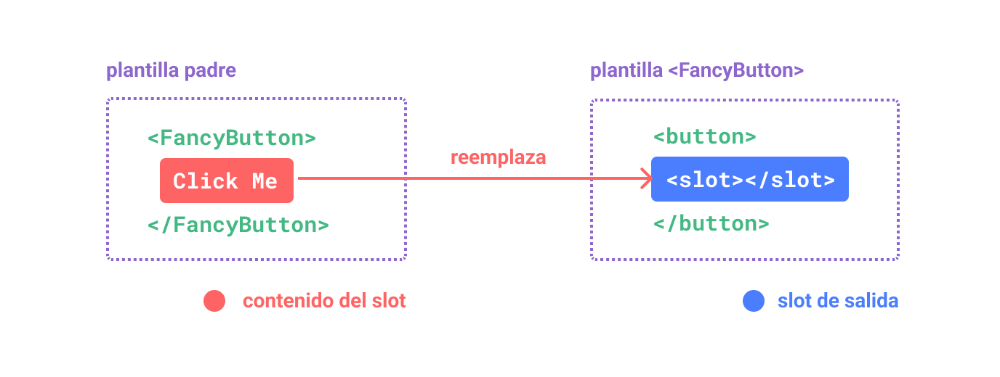

# Slots {#slots}

> Esta página asume que ya has leído los [Fundamentos de Componentes](/guide/essentials/component-basics). Léela primero si eres nuevo en los componentes.

<VueSchoolLink href="https://vueschool.io/lessons/vue-3-component-slots" title="Lección Gratuita de Slots de Vue.js"/>

## Contenido y Salida de Slot {#slot-content-and-outlet}

Hemos aprendido que los componentes pueden aceptar `props`, que pueden ser valores JavaScript de cualquier tipo. Pero, ¿qué pasa con el contenido de la plantilla? En algunos casos, es posible que queramos pasar un fragmento de plantilla a un componente hijo, y dejar que el componente hijo renderice el fragmento dentro de su propia plantilla.

Por ejemplo, podríamos tener un componente `<FancyButton>` que admita un uso como este:

```vue-html{2}
<FancyButton>
  Click me! <!-- slot content -->
</FancyButton>
```

La plantilla de `<FancyButton>` se ve así:

```vue-html{2}
<button class="fancy-btn">
  <slot></slot> <!-- slot outlet -->
</button>
```

El elemento `<slot>` es una **salida de slot** que indica dónde debe renderizarse el **contenido del slot** proporcionado por el padre.



<!-- https://www.figma.com/file/LjKTYVL97Ck6TEmBbstavX/slot -->

Y el DOM renderizado final:

```html
<button class="fancy-btn">Click me!</button>
```

<div class="composition-api">

[Pruébalo en el Playground](https://play.vuejs.org/#eNpdUdlqAyEU/ZVbQ0kLMdNsXabTQFvoV8yLcRkkjopLSQj596oTwqRvnuM9y9UT+rR2/hs5qlHjqZM2gOch2m2rZW+NC/BDND1+xRCMBuFMD9N5NeKyeNrqphrUSZdA4L1VJPCEAJrRdCEAvpWke+g5NHcYg1cmADU6cB0A4zzThmYckqimupqiGfpXILe/zdwNhaki3n+0SOR5vAu6ReU++efUajtqYGJQ/FIg5w8Wt9FlOx+OKh/nV1c4ZVNqlHE1TIQQ7xnvCN13zkTNalBSc+Jw5wiTac2H1WLDeDeDyXrJVm9LWG7uE3hev3AhHge1cYwnO200L4QljEnd1bCxB1g82UNhe+I6qQs5kuGcE30NrxeaRudzOWtkermeXuHP5tLIKOv8BN+mw3w==)

</div>
<div class="options-api">

[Pruébalo en el Playground](https://play.vuejs.org/#eNpdUdtOwzAM/RUThAbSurIbl1ImARJf0ZesSppoqROlKdo07d9x0jF1SHmIT+xzcY7sw7nZTy9Zwcqu9tqFTYW6ddYH+OZYHz77ECyC8raFySwfYXFsUiFAhXKfBoRUvDcBjhGtLbGgxNAVcLziOlVIJ8y+elQE2TrDg6QKoBx1JwDgy+h6B62E8ibLoDM2kAAGoocsiz1VKMfmCCrzCymbsn/GY95rze1grna8694rpmJ/tg1YsfRO/FE134wc2D4YeTYQ9QeKa+mUrgsHE6+zC+vfjoz1Bdwqpd5iveX1rvG2R1GA0Si5zxrPhaaY98v5WshmCrerhVi+LmCxvqPiafUslXoYpq0XkuiQ1p4Ax4XQ2BSwdnuYP7p9QlvuG40JHI1lUaenv3o5w3Xvu2jOWU179oQNn5aisNMvLBvDOg==)

</div>

Con los slots, el `<FancyButton>` es responsable de renderizar el `<button>` exterior (y su estilo sofisticado), mientras que el contenido interno es proporcionado por el componente padre.

Otra forma de entender los slots es comparándolos con las funciones de JavaScript:

```js
// parent component passing slot content
FancyButton('Click me!')

// FancyButton renders slot content in its own template
function FancyButton(slotContent) {
  return `<button class="fancy-btn">
      ${slotContent}
    </button>`
}
```

El contenido del slot no se limita solo a texto. Puede ser cualquier contenido de plantilla válido. Por ejemplo, podemos pasar múltiples elementos, o incluso otros componentes:

```vue-html
<FancyButton>
  <span style="color:red">Click me!</span>
  <AwesomeIcon name="plus" />
</FancyButton>
```

<div class="composition-api">

[Pruébalo en el Playground](https://play.vuejs.org/#eNp1UmtOwkAQvspQYtCEgrx81EqCJibeoX+W7bRZaHc3+1AI4QyewH8ewvN4Aa/gbgtNIfFf5+vMfI/ZXbCQcvBmMYiCWFPFpAGNxsp5wlkphTLwQjjdPlljBIdMiRJ6g2EL88O9pnnxjlqU+EpbzS3s0BwPaypH4gqDpSyIQVcBxK3VFQDwXDC6hhJdlZi4zf3fRKwl4aDNtsDHJKCiECqiW8KTYH5c1gEnwnUdJ9rCh/XeM6Z42AgN+sFZAj6+Ux/LOjFaEK2diMz3h0vjNfj/zokuhPFU3lTdfcpShVOZcJ+DZgHs/HxtCrpZlj34eknoOlfC8jSCgnEkKswVSRlyczkZzVLM+9CdjtPJ/RjMswtX3ExvMcuu6mmhUnTruOBYAZKkKeN5BDO5gdG13FRoSVTOeAW2xkLPY3UEdweYWqW9OCkYN6gctq9uXllx2Z09CJ9dJwzBascI7nBYihWDldUGMqEgdTVIq6TQqCEMfUpNSD+fX7/fH+3b7P8AdGP6wA==)

</div>
<div class="options-api">

[Pruébalo en el Playground](https://play.vuejs.org/#eNptUltu2zAQvMpGQZEWsOzGiftQ1QBpgQK9g35oaikwkUiCj9aGkTPkBPnLIXKeXCBXyJKKBdoIoA/tYGd3doa74tqY+b+ARVXUjltp/FWj5GC09fCHKb79FbzXCoTVA5zNFxkWaWdT8/V/dHrAvzxrznC3ZoBG4SYRWhQs9B52EeWapihU3lWwyxfPDgbfNYq+ejEppcLjYHrmkSqAOqMmAOB3L/ktDEhV4+v8gMR/l1M7wxQ4v+3xZ1Nw3Wtb8S1TTXG1H3cCJIO69oxc5mLUcrSrXkxSi1lxZGT0//CS9Wg875lzJELE/nLto4bko69dr31cFc8auw+3JHvSEfQ7nwbsHY9HwakQ4kes14zfdlYH1VbQS4XMlp1lraRMPl6cr1rsZnB6uWwvvi9hufpAxZfLryjEp5GtbYs0TlGICTCsbaXqKliZDZx/NpuEDsx2UiUwo5VxT6Dkv73BPFgXxRktlUdL2Jh6OoW8O3pX0buTsoTgaCNQcDjoGwk3wXkQ2tJLGzSYYI126KAso0uTSc8Pjy9P93k2d6+NyRKa)

</div>

Al usar slots, nuestro `<FancyButton>` es más flexible y reutilizable. Ahora podemos usarlo en diferentes lugares con diferente contenido interno, pero todos con el mismo estilo sofisticado.

El mecanismo de slots de los componentes Vue está inspirado en el [elemento `<slot>` nativo de Web Component](https://developer.mozilla.org/en-US/docs/Web/HTML/Element/slot), pero con capacidades adicionales que veremos más adelante.

## Ámbito de Renderizado {#render-scope}

El contenido del slot tiene acceso al ámbito de datos del componente padre, porque está definido en el padre. Por ejemplo:

```vue-html
<span>{{ message }}</span>
<FancyButton>{{ message }}</FancyButton>
```

Aquí ambas interpolaciones <span v-pre>`{{ message }}`</span> renderizarán el mismo contenido.

El contenido del slot **no** tiene acceso a los datos del componente hijo. Las expresiones en las plantillas de Vue solo pueden acceder al ámbito en el que están definidas, lo que es consistente con el alcance léxico de JavaScript. En otras palabras:

> Las expresiones en la plantilla padre solo tienen acceso al ámbito padre; las expresiones en la plantilla hijo solo tienen acceso al ámbito hijo.

## Contenido Alternativo {#fallback-content}

Hay casos en los que es útil especificar contenido de reserva (es decir, por defecto) para un slot, que se renderizará solo cuando no se proporcione ningún contenido. Por ejemplo, en un componente `<SubmitButton>`:

```vue-html
<button type="submit">
  <slot></slot>
</button>
```

Podríamos querer que el texto "Submit" se renderice dentro del `<button>` si el padre no proporcionó ningún contenido de slot. Para hacer que "Submit" sea el contenido de reserva, podemos colocarlo entre las etiquetas `<slot>`:

```vue-html{3}
<button type="submit">
  <slot>
    Submit <!-- fallback content -->
  </slot>
</button>
```

Ahora, cuando usamos `<SubmitButton>` en un componente padre, sin proporcionar contenido para el slot:

```vue-html
<SubmitButton />
```

Esto renderizará el contenido de reserva, "Submit":

```html
<button type="submit">Submit</button>
```

Pero si proporcionamos contenido:

```vue-html
<SubmitButton>Save</SubmitButton>
```

Entonces el contenido proporcionado será renderizado en su lugar:

```html
<button type="submit">Save</button>
```

<div class="composition-api">

[Pruébalo en el Playground](https://play.vuejs.org/#eNp1kMsKwjAQRX9lzMaNbfcSC/oL3WbT1ikU8yKZFEX8d5MGgi2YVeZxZ86dN7taWy8B2ZlxP7rZEnikYFuhZ2WNI+jCoGa6BSKjYXJGwbFufpNJfhSaN1kflTEgVFb2hDEC4IeqguARpl7KoR8fQPgkqKpc3Wxo1lxRWWeW+Y4wBk9x9V9d2/UL8g1XbOJN4WAntodOnrecQ2agl8WLYH7tFyw5olj10iR3EJ+gPCxDFluj0YS6EAqKR8mi9M3Td1ifLxWShcU=)

</div>
<div class="options-api">

[Pruébalo en el Playground](https://play.vuejs.org/#eNp1UEEOwiAQ/MrKxYu1d4Mm+gWvXChuk0YKpCyNxvh3lxIb28SEA8zuDDPzEucQ9mNCcRAymqELdFKu64MfCK6p6Tu6JCLvoB18D9t9/Qtm4lY5AOXwMVFu2OpkCV4ZNZ51HDqKhwLAQjIjb+X4yHr+mh+EfbCakF8AclNVkCJCq61ttLkD4YOgqsp0YbGesJkVBj92NwSTIrH3v7zTVY8oF8F4SdazD7ET69S5rqXPpnigZ8CjEnHaVyInIp5G63O6XIGiIlZMzrGMd8RVfR0q4lIKKV+L+srW+wNTTZq3)

</div>

## Slots con Nombre {#named-slots}

Hay ocasiones en las que es útil tener múltiples salidas de slot en un solo componente. Por ejemplo, en un componente `<BaseLayout>` con la siguiente plantilla:

```vue-html
<div class="container">
  <header>
    <!-- We want header content here -->
  </header>
  <main>
    <!-- We want main content here -->
  </main>
  <footer>
    <!-- We want footer content here -->
  </footer>
</div>
```

Para estos casos, el elemento `<slot>` tiene un atributo especial, `name`, que puede usarse para asignar un ID único a diferentes slots para que puedas determinar dónde debe renderizarse el contenido:

```vue-html
<div class="container">
  <header>
    <slot name="header"></slot>
  </header>
  <main>
    <slot></slot>
  </main>
  <footer>
    <slot name="footer"></slot>
  </footer>
</div>
```

Una salida `<slot>` sin `name` tiene implícitamente el nombre "default".

En un componente padre que utiliza `<BaseLayout>`, necesitamos una forma de pasar múltiples fragmentos de contenido de slot, cada uno dirigido a una salida de slot diferente. Aquí es donde entran los **slots nombrados**.

Para pasar un slot nombrado, necesitamos usar un elemento `<template>` con la directiva `v-slot`, y luego pasar el nombre del slot como argumento a `v-slot`:

```vue-html
<BaseLayout>
  <template v-slot:header>
    <!-- content for the header slot -->
  </template>
</BaseLayout>
```

`v-slot` tiene una abreviatura dedicada `#`, por lo que `<template v-slot:header>` puede acortarse a simplemente `<template #header>`. Piensa en ello como "renderizar este fragmento de plantilla en el slot 'header' del componente hijo".


<!-- https://www.figma.com/file/2BhP8gVZevttBu9oUmUUyz/named-slot -->

Aquí está el código que pasa contenido para los tres slots a `<BaseLayout>` usando la sintaxis abreviada:

```vue-html
<BaseLayout>
  <template #header>
    <h1>Here might be a page title</h1>
  </template>

  <template #default>
    <p>A paragraph for the main content.</p>
    <p>And another one.</p>
  </template>

  <template #footer>
    <p>Here's some contact info</p>
  </template>
</BaseLayout>
```

Cuando un componente acepta tanto un slot por defecto como slots nombrados, todos los nodos de nivel superior que no son `<template>` se tratan implícitamente como contenido para el slot por defecto. Así que lo anterior también se puede escribir como:

```vue-html
<BaseLayout>
  <template #header>
    <h1>Here might be a page title</h1>
  </template>

  <!-- implicit default slot -->
  <p>A paragraph for the main content.</p>
  <p>And another one.</p>

  <template #footer>
    <p>Here's some contact info</p>
  </template>
</BaseLayout>
```

Ahora, todo lo que esté dentro de los elementos `<template>` se pasará a los slots correspondientes. El HTML renderizado final será:

```html
<div class="container">
  <header>
    <h1>Here might be a page title</h1>
  </header>
  <main>
    <p>A paragraph for the main content.</p>
    <p>And another one.</p>
  </main>
  <footer>
    <p>Here's some contact info</p>
  </footer>
</div>
```

<div class="composition-api">

[Pruébalo en el Playground](https://play.vuejs.org/#eNp9UsFuwjAM/RWrHLgMOi5o6jIkdtphn9BLSF0aKU2ixEVjiH+fm8JoQdvRfu/5xS8+ZVvvl4cOsyITUQXtCSJS5zel1a13geBdRvyUR9cR1MG1MF/mt1YvnZdW5IOWVVwQtt5IQq4AxI2cau5ccZg1KCsMlz4jzWrzgQGh1fuGYIcgwcs9AmkyKHKGLyPykcfD1Apr2ZmrHUN+s+U5Qe6D9A3ULgA1bCK1BeUsoaWlyPuVb3xbgbSOaQGcxRH8v3XtHI0X8mmfeYToWkxmUhFoW7s/JvblJLERmj1l0+T7T5tqK30AZWSMb2WW3LTFUGZXp/u8o3EEVrbI9AFjLn8mt38fN9GIPrSp/p4/Yoj7OMZ+A/boN9KInPeZZpAOLNLRDAsPZDgN4p0L/NQFOV/Ayn9x6EZXMFNKvQ4E5YwLBczW6/WlU3NIi6i/sYDn5Qu2qX1OF51MsvMPkrIEHg==)

</div>
<div class="options-api">

[Pruébalo en el Playground](https://play.vuejs.org/#eNp9UkFuwjAQ/MoqHLiUpFxQlaZI9NRDn5CLSTbEkmNb9oKgiL934wRwQK3ky87O7njGPicba9PDHtM8KXzlpKV1qWVnjSP4FB6/xcnsCRpnOpin2R3qh+alBig1HgO9xkbsFcG5RyvDOzRq8vkAQLSury+l5lNkN1EuCDurBCFXAMWdH2pGrn2YtShqdCPOnXa5/kKH0MldS7BFEGDFDoEkKSwybo8rskjjaevo4L7Wrje8x4mdE7aFxjiglkWE1GxQE9tLi8xO+LoGoQ3THLD/qP2/dGMMxYZM8DP34E2HQUxUBFI35o+NfTlJLOomL8n04frXns7W8gCVEt5/lElQkxpdmVyVHvP2yhBo0SHThx5z+TEZvl1uMlP0oT3nH/kRo3iMI9Ybes960UyRsZ9pBuGDeTqpwfBAvn7NrXF81QUZm8PSHjl0JWuYVVX1PhAqo4zLYbZarUak4ZAWXv5gDq/pG3YBHn50EEkuv5irGBk=)

</div>

De nuevo, puede que te ayude a entender mejor los slots nombrados usando la analogía de la función de JavaScript:

```js
// passing multiple slot fragments with different names
BaseLayout({
  header: `...`,
  default: `...`,
  footer: `...`
})

// <BaseLayout> renders them in different places
function BaseLayout(slots) {
  return `<div class="container">
      <header>${slots.header}</header>
      <main>${slots.default}</main>
      <footer>${slots.footer}</footer>
    </div>`
}
```

## Slots Condicionales {#conditional-slots}

A veces, quieres renderizar algo basándote en si se ha pasado contenido a un slot o no.

Puedes usar la propiedad [$slots](/api/component-instance.html#slots) en combinación con un [v-if](/guide/essentials/conditional.html#v-if) para lograr esto.

En el siguiente ejemplo, definimos un componente `Card` con tres slots condicionales: `header`, `footer` y el `default`.
Cuando el contenido para el `header` / `footer` / `default` está presente, queremos envolverlo para proporcionar un estilo adicional:

```vue-html
<template>
  <div class="card">
    <div v-if="$slots.header" class="card-header">
      <slot name="header" />
    </div>

    <div v-if="$slots.default" class="card-content">
      <slot />
    </div>

    <div v-if="$slots.footer" class="card-footer">
      <slot name="footer" />
    </div>
  </div>
</template>
```

[Pruébalo en el Playground](https://play.vuejs.org/#eNqVVMtu2zAQ/BWCLZBLIjVoTq4aoA1yaA9t0eaoCy2tJcYUSZCUKyPwv2dJioplOw4C+EDuzM4+ONYT/aZ1tumBLmhhK8O1IxZcr29LyTutjCN3zNRkZVRHLrLcXzz9opRFHvnIxIuDTgvmAG+EFJ4WTnhOCPnQAqvBjHFE2uvbh5Zbgj/XAolwkWN4TM33VI/UalixXvjyo5yeqVVKOpCuyP0ob6utlHL7vUE3U4twkWP4hJq/jiPP4vSSOouNrHiTPVolcclPnl3SSnWaCzC/teNK2pIuSEA8xoRQ/3+GmDM9XKZ41UK1PhF/tIOPlfSPAQtmAyWdMMdMAy7C9/9+wYDnCexU3QtknwH/glWi9z1G2vde1tj2Hi90+yNYhcvmwd4PuHabhvKNeuYu8EuK1rk7M/pLu5+zm5BXyh1uMdnOu3S+95pvSCWYtV9xQcgqaXogj2yu+AqBj1YoZ7NosJLOEq5S9OXtPZtI1gFSppx8engUHs+vVhq9eVhq9ORRrXdpRyseSqfo6SmmnONK6XTw9yis24q448wXSG+0VAb3sSDXeiBoDV6TpWDV+ktENatrdMGCfAoBfL1JYNzzpINJjVFoJ9yKUKho19ul6OFQ6UYPx1rjIpPYeXIc/vXCgjetawzbni0dPnhhJ3T3DMVSruI=)

## Nombres de Slot Dinámicos {#dynamic-slot-names}

Los [argumentos de directiva dinámicos](/guide/essentials/template-syntax.md#dynamic-arguments) también funcionan en `v-slot`, permitiendo la definición de nombres de slot dinámicos:

```vue-html
<base-layout>
  <template v-slot:[dynamicSlotName]>
    ...
  </template>

  <!-- with shorthand -->
  <template #[dynamicSlotName]>
    ...
  </template>
</base-layout>
```

Ten en cuenta que la expresión está sujeta a las [restricciones de sintaxis](/guide/essentials/template-syntax.md#dynamic-argument-syntax-constraints) de los argumentos de directiva dinámicos.

## Slots con Ámbito {#scoped-slots}

Como se discutió en [Ámbito de Renderizado](#render-scope), el contenido del slot no tiene acceso al estado del componente hijo.

Sin embargo, hay casos en los que podría ser útil si el contenido de un slot puede utilizar datos tanto del ámbito padre como del ámbito hijo. Para lograr esto, necesitamos una forma de que el hijo pase datos a un slot al renderizarlo.

De hecho, podemos hacer exactamente eso: podemos pasar atributos a una salida de slot como si pasaras `props` a un componente:

```vue-html
<!-- <MyComponent> template -->
<div>
  <slot :text="greetingMessage" :count="1"></slot>
</div>
```

Recibir las `slot props` es un poco diferente cuando se usa un solo slot por defecto en comparación con el uso de slots nombrados. Primero mostraremos cómo recibir `props` usando un solo slot por defecto, usando `v-slot` directamente en la etiqueta del componente hijo:

```vue-html
<MyComponent v-slot="slotProps">
  {{ slotProps.text }} {{ slotProps.count }}
</MyComponent>
```


<!-- https://www.figma.com/file/QRneoj8eIdL1kw3WQaaEyc/scoped-slot -->

<div class="composition-api">

[Pruébalo en el Playground](https://play.vuejs.org/#eNp9kMEKgzAMhl8l9OJlU3aVOhg7C3uAXsRlTtC2tFE2pO++dA5xMnZqk+b/8/2dxMnadBxQ5EL62rWWwCMN9qh021vjCMrn2fBNoya4OdNDkmarXhQnSstsVrOOC8LedhVhrEiuHca97wwVSsTj4oz1SvAUgKJpgqWZEj4IQoCvZm0Gtgghzss1BDvIbFkqdmID+CNdbbQnaBwitbop0fuqQSgguWPXmX+JePe1HT/QMtJBHnE51MZOCcjfzPx04JxsydPzp2Szxxo7vABY1I/p)

</div>
<div class="options-api">

[Pruébalo en el Playground](https://play.vuejs.org/#eNqFkNFqxCAQRX9l8CUttAl9DbZQ+rzQD/AlJLNpwKjoJGwJ/nvHpAnusrAg6FzHO567iE/nynlCUQsZWj84+lBmGJ31BKffL8sng4bg7O0IRVllWnpWKAOgDF7WBx2em0kTLElt975QbwLkhkmIyvCS1TGXC8LR6YYwVSTzH8yvQVt6VyJt3966oAR38XhaFjjEkvBCECNcia2d2CLyOACZQ7CDrI6h4kXcAF7lcg+za6h5et4JPdLkzV4B9B6RBtOfMISmxxqKH9TarrGtATxMgf/bDfM/qExEUCdEDuLGXAmoV06+euNs2JK7tyCrzSNHjX9aurQf)

</div>

Las `props` pasadas al slot por el hijo están disponibles como el valor de la directiva `v-slot` correspondiente, a la que se puede acceder mediante expresiones dentro del slot.

Puedes pensar en un slot con ámbito como una función que se pasa al componente hijo. El componente hijo la llama, pasando `props` como argumentos:

```js
MyComponent({
  // passing the default slot, but as a function
  default: (slotProps) => {
    return `${slotProps.text} ${slotProps.count}`
  }
})

function MyComponent(slots) {
  const greetingMessage = 'hello'
  return `<div>${
    // call the slot function with props!
    slots.default({ text: greetingMessage, count: 1 })
  }</div>`
}
```

De hecho, esto es muy similar a cómo se compilan los slots con ámbito, y cómo usarías los slots con ámbito en [render functions](/guide/extras/render-function) manuales.

Observa cómo `v-slot="slotProps"` coincide con la firma de la función del slot. Al igual que con los argumentos de función, podemos usar la desestructuración en `v-slot`:

```vue-html
<MyComponent v-slot="{ text, count }">
  {{ text }} {{ count }}
</MyComponent>
```

### Slots Nombrados con Ámbito {#named-scoped-slots}

Los slots nombrados con ámbito funcionan de manera similar: las `slot props` son accesibles como el valor de la directiva `v-slot`: `v-slot:name="slotProps"`. Cuando se usa la abreviatura, se ve así:

```vue-html
<MyComponent>
  <template #header="headerProps">
    {{ headerProps }}
  </template>

  <template #default="defaultProps">
    {{ defaultProps }}
  </template>

  <template #footer="footerProps">
    {{ footerProps }}
  </template>
</MyComponent>
```

Pasando `props` a un slot nombrado:

```vue-html
<slot name="header" message="hello"></slot>
```

Ten en cuenta que el `name` de un slot no se incluirá en las `props` porque está reservado, por lo que las `headerProps` resultantes serían `{ message: 'hello' }`.

Si estás mezclando slots nombrados con el slot por defecto con ámbito, necesitas usar una etiqueta `<template>` explícita para el slot por defecto. Intentar colocar la directiva `v-slot` directamente en el componente resultará en un error de compilación. Esto es para evitar cualquier ambigüedad sobre el ámbito de las `props` del slot por defecto. Por ejemplo:

```vue-html
<!-- <MyComponent> template -->
<div>
  <slot :message="hello"></slot>
  <slot name="footer" />
</div>
```

```vue-html
<!-- This template won't compile -->
<MyComponent v-slot="{ message }">
  <p>{{ message }}</p>
  <template #footer>
    <!-- message belongs to the default slot, and is not available here -->
    <p>{{ message }}</p>
  </template>
</MyComponent>
```

Usar una etiqueta `<template>` explícita para el slot por defecto ayuda a dejar claro que la `prop` `message` no está disponible dentro del otro slot:

```vue-html
<MyComponent>
  <!-- Use explicit default slot -->
  <template #default="{ message }">
    <p>{{ message }}</p>
  </template>

  <template #footer>
    <p>Here's some contact info</p>
  </template>
</MyComponent>
```

### Ejemplo de Lista Sofisticada {#fancy-list-example}

Puede que te estés preguntando cuál sería un buen caso de uso para los slots con ámbito. Aquí tienes un ejemplo: imagina un componente `<FancyList>` que renderiza una lista de ítems; podría encapsular la lógica para cargar datos remotos, usar esos datos para mostrar una lista, o incluso características avanzadas como paginación o desplazamiento infinito. Sin embargo, queremos que sea flexible en cuanto a la apariencia de cada ítem y dejar el estilo de cada ítem al componente padre que lo consume. Así, el uso deseado podría verse así:

```vue-html
<FancyList :api-url="url" :per-page="10">
  <template #item="{ body, username, likes }">
    <div class="item">
      <p>{{ body }}</p>
      <p>by {{ username }} | {{ likes }} likes</p>
    </div>
  </template>
</FancyList>
```

Dentro de `<FancyList>`, podemos renderizar el mismo `<slot>` varias veces con diferentes datos de ítem (observa que estamos usando `v-bind` para pasar un objeto como `slot props`):

```vue-html
<ul>
  <li v-for="item in items">
    <slot name="item" v-bind="item"></slot>
  </li>
</ul>
```

<div class="composition-api">

[Pruébalo en el Playground](https://play.vuejs.org/#eNqFU2Fv0zAQ/StHJtROapNuZTBCNwnQQKBpTGxCQss+uMml8+bYlu2UlZL/zjlp0lQa40sU3/nd3Xv3vA7eax0uSwziYGZTw7UDi67Up4nkhVbGwScm09U5tw5yoyoYhFEX8cBBImdRgyQMHRwWWjCHdAKYbdFM83FpxEkS0DcJINZoxrotkCIHkySo7xOixcMep19KrmGustUISotGsgJHIPgDWqg6DKEyvoRUMGsJ4HG9HGX16bqpAlU1izy5baqDFegYweYroMttMwLAHx/Y9Kyan36RWUTN2+mjXfpbrei8k6SjdSuBYFOlMaNI6AeAtcflSrqx5b8xhkl4jMU7H0yVUCaGvVeH8+PjKYWqWnpf5DQYBTtb+fc612Awh2qzzGaBiUyVpBVpo7SFE8gw5xIv/Wl4M9gsbjCCQbuywe3+FuXl9iiqO7xpElEEhUofKFQo2mTGiFiOLr3jcpFImuiaF6hKNxzuw8lpw7kuEy6ZKJGK3TR6NluLYXBVqwRXQjkLn0ueIc3TLonyZ0sm4acqKVovKIbDCVQjGsb1qvyg2telU4Yzz6eHv6ARBWdwjVqUNCbbFjqgQn6aW1J8RKfJhDg+5/lStG4QHJZjnpO5XjT0BMqFu+uZ81yxjEQJw7A1kOA76FyZjaWBy0akvu8tCQKeQ+d7wsy5zLpz1FlzU3kW1QP+x40ApWgWAySEJTv6/NitNMkllcTakwCaZZ5ADEf6cROas/RhYVQps5igEpkZLwzRROmG04OjDBcj7+Js+vYQDo9e0uH1qzeY5/s1vtaaqG969+vTTrsmBTMLLv12nuy7l+d5W673SBzxkzlfhPdWSXokdZMkSFWhuUDzTTtOnk6CuG2fBEwI9etrHXOmRLJUE0/vMH14In5vH30sCS4Nkr+WmARdztHQ6Jr02dUFPtJ/lyxUVgq6/UzyO1olSj9jc+0DcaWxe/fqab/UT51Uu7Znjw6lbUn5QWtR6vtJQM//4zPUt+NOw+lGzCqo/gLm1QS8)

</div>
<div class="options-api">

[Pruébalo en el Playground](https://play.vuejs.org/#eNqNVNtq20AQ/ZWpQnECujhO0qaqY+hD25fQl4RCifKwllbKktXushcT1/W/d1bSSnYJNCCEZmbPmcuZ1S76olS6cTTKo6UpNVN2VQjWKqktfCOi3N4yY6HWsoVZmo0eD5kVAqAQ9KU7XNGaOG5h572lRAZBhTV574CJzJv7QuCzzMaMaFjaKk4sRQtgOeUmiiVO85siwncRQa6oThRpKHrO50XUnUdEwMMJw08M7mAtq20MzlAtSEtj4OyZGkweMIiq2AZKToxBgMcdxDCqVrueBfb7ZaaOQiOspZYgbL0FPBySIQD+eMeQc99/HJIsM0weqs+O258mjfZREE1jt5yCKaWiFXpSX0A/5loKmxj2m+YwT69p+7kXg0udw8nlYn19fYGufvSeZBXF0ZGmR2vwmrJKS4WiPswGWWYxzIIgs8fYH6mIJadnQXdNrdMiWAB+yJ7gsXdgLfjqcK10wtJqgmYZ+spnpGgl6up5oaa2fGKi6U8Yau9ZS6Wzpwi7WU1p7BMzaZcLbuBh0q2XM4fZXTc+uOPSGvjuWEWxlaAexr9uiIBf0qG3Uy6HxXwo9B+mn47CvbNSM+LHccDxAyvmjMA9Vdxh1WQiO0eywBVGEaN3Pj972wVxPKwOZ7BJWI2b+K5rOOVUNPbpSJNvJalwZmmahm3j7AhdSz3sPzDRS3R4SQwOCXxP4yVBzJqJarSzcY8H5mXWFfif1QVwPGjGcQWTLp7YrcLxCfyDdAuMW0cq30AOV+plcK1J+dxoXJkqR6igRCeNxjbxp3N6cX5V0Sb2K19dfFrA4uo9Gh8uP9K6Puvw3eyx9SH3IT/qPCZpiW6Y8Gq9mvekrutAN96o/V99ALPj)

</div>

### Componentes Renderless {#renderless-components}

El caso de uso de `<FancyList>` que discutimos anteriormente encapsula tanto la lógica reutilizable (obtención de datos, paginación, etc.) como la salida visual, mientras delega parte de la salida visual al componente consumidor a través de slots con ámbito.

Si llevamos este concepto un poco más allá, podemos crear componentes que solo encapsulan lógica y no renderizan nada por sí mismos; la salida visual se delega completamente al componente consumidor con slots con ámbito. A este tipo de componente lo llamamos **Componente Renderless**.

Un ejemplo de componente renderless podría ser uno que encapsule la lógica de seguimiento de la posición actual del ratón:

```vue-html
<MouseTracker v-slot="{ x, y }">
  Mouse is at: {{ x }}, {{ y }}
</MouseTracker>
```

<div class="composition-api">

[Pruébalo en el Playground](https://play.vuejs.org/#eNqNUcFqhDAQ/ZUhF12w2rO4Cz301t5aaCEX0dki1SQko6uI/96J7i4qLPQQmHmZ9+Y9ZhQvxsRdiyIVmStsZQgcUmtOUlWN0ZbgXbcOP2xe/KKFs3UNBHGyBj09kCpLFj4zuSFsTJ0T+o6yjUb35GpNRylG6CMYYJKCpwAkzWNQOcgphZG/YZoiX/DQNAttFjMrS+6LRCT2rh6HGsHiOQKtmKIIS19+qmZpYLrmXIKxM1Vo5Yj9HD0vfD7ckGGF3LDWlOyHP/idYPQCfdzldTtjscl/8MuDww78lsqHVHdTYXjwCpdKlfoS52X52qGit8oRKrRhwHYdNrrDILouPbCNVZCtgJ1n/6Xx8JYAmT8epD3fr5cC0oGLQYpkd4zpD27R0vA=)

</div>
<div class="options-api">

[Pruébalo en el Playground](https://play.vuejs.org/#eNqVUU1rwzAM/SvCl7SQJTuHdLDDbttthw18MbW6hjW2seU0oeS/T0lounQfUBGepZenvxO4tG5rIkoClGGra8cPUhT1c56ghcbA756tf1EDztva0iy/Ds4NCbSAEiD7diicafigeA0oFvLPAYNhWICYEE5IL00fMp8Hs0JYe0OinDIqFyIaO7CwdJGihO0KXTcLriK59NYBlUARTyMn6Hv0yHgIp7ARAvl3FXm8yCRiuu1Fv/x23JakVqtz3t5pOjNOQNoC7hPz0nHyRSzEr7Ghxppb/XlZ6JjRlzhTAlA+ypkLWwAM6c+8G2BdzP+/pPbRkOoL/KoldH2mCmtnxr247kKhAb9KuHKgLVtMEkn2knG+sIVzV9sfmy8hfB/swHKwV0oWja4lQKKjoNOivzKrf4L/JPqaQ==)

</div>

Si bien es un patrón interesante, la mayor parte de lo que se puede lograr con los Componentes Renderless se puede conseguir de una manera más eficiente con la Composition API, sin incurrir en la sobrecarga de anidamiento de componentes adicional. Más adelante, veremos cómo podemos implementar la misma funcionalidad de seguimiento del ratón como un [Composable](/guide/reusability/composables).

Dicho esto, los slots con ámbito siguen siendo útiles en casos en los que necesitamos tanto encapsular la lógica **como** componer la salida visual, como en el ejemplo de `<FancyList>`.
