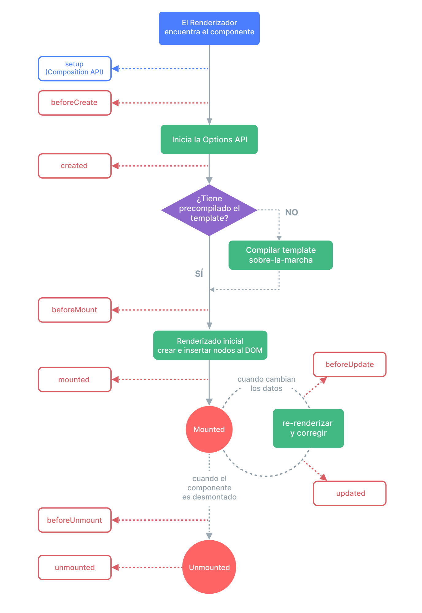

# Hooks del Ciclo de Vida {#lifecycle-hooks}

Cada instancia de componente Vue pasa por una serie de pasos de inicialización cuando se crea; por ejemplo, necesita configurar la observación de datos, compilar la plantilla, montar la instancia en el DOM y actualizar el DOM cuando los datos cambian. A lo largo del proceso, también ejecuta funciones llamadas hooks de ciclo de vida, lo que brinda a los usuarios la oportunidad de agregar su propio código en etapas específicas.

## Registrando Hooks del Ciclo de Vida {#registering-lifecycle-hooks}

Por ejemplo, el hook <span class="composition-api">`onMounted`</span><span class="options-api">`mounted`</span> se puede usar para ejecutar código después de que el componente haya terminado la renderización inicial y haya creado los nodos DOM:

<div class="composition-api">

```vue
<script setup>
import { onMounted } from 'vue'

onMounted(() => {
  console.log(`the component is now mounted.`)
})
</script>
```

</div>
<div class="options-api">

```js
export default {
  mounted() {
    console.log(`the component is now mounted.`)
  }
}
```

</div>

También hay otros hooks que se llamarán en diferentes etapas del ciclo de vida de la instancia, siendo los más utilizados <span class="composition-api">[`onMounted`](/api/composition-api-lifecycle#onmounted), [`onUpdated`](/api/composition-api-lifecycle#onupdated), y [`onUnmounted`](/api/composition-api-lifecycle#onunmounted).</span><span class="options-api">[`mounted`](/api/options-lifecycle#mounted), [`updated`](/api/options-lifecycle#updated), y [`unmounted`](/api/options-lifecycle#unmounted).</span>

<div class="options-api">

Todos los hooks de ciclo de vida se llaman con su contexto `this` apuntando a la instancia activa actual que lo invoca. Ten en cuenta que esto significa que debes evitar usar funciones de flecha al declarar hooks de ciclo de vida, ya que no podrás acceder a la instancia del componente a través de `this` si lo haces.

</div>

<div class="composition-api">

Al llamar a `onMounted`, Vue asocia automáticamente la función de callback registrada con la instancia de componente activa actual. Esto requiere que estos hooks se registren **sincrónicamente** durante la configuración del componente. Por ejemplo, no hagas esto:

```js
setTimeout(() => {
  onMounted(() => {
    // this won't work.
  })
}, 100)
```

Ten en cuenta que esto no significa que la llamada deba colocarse léxicamente dentro de `setup()` o `<script setup>`. `onMounted()` puede ser llamado en una función externa siempre que la pila de llamadas sea síncrona y se origine desde dentro de `setup()`.

</div>

## Diagrama del Ciclo de Vida {#lifecycle-diagram}

A continuación se muestra un diagrama del ciclo de vida de la instancia. No necesitas entender completamente todo lo que sucede ahora mismo, pero a medida que aprendas y construyas más, será una referencia útil.



<!-- https://www.figma.com/file/Xw3UeNMOralY6NV7gSjWdS/Vue-Lifecycle -->

Consulta la <span class="composition-api">[referencia de la API de Hooks de Ciclo de Vida](/api/composition-api-lifecycle)</span><span class="options-api">[referencia de la API de Hooks de Ciclo de Vida](/api/options-lifecycle)</span> para obtener detalles sobre todos los hooks de ciclo de vida y sus respectivos casos de uso.
