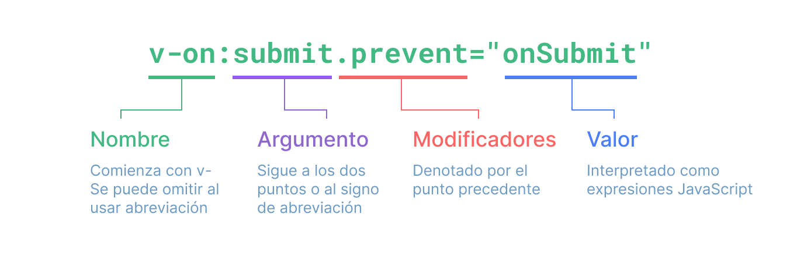

# Sintaxis de Plantilla {#template-syntax}

<ScrimbaLink href="https://scrimba.com/links/vue-template-syntax" title="Lección gratuita e interactiva de Sintaxis de Plantilla de Vue.js" type="scrimba">
  Mira una lección en video interactiva en Scrimba
</ScrimbaLink>

Vue utiliza una sintaxis de plantilla basada en HTML que te permite enlazar declarativamente el DOM renderizado con los datos de la instancia del componente subyacente. Todas las plantillas de Vue son HTML sintácticamente válido que puede ser analizado por navegadores y analizadores HTML que cumplen con las especificaciones.

Internamente, Vue compila las plantillas en código JavaScript altamente optimizado. Combinado con el sistema de reactividad, Vue puede determinar inteligentemente el número mínimo de componentes a re-renderizar y aplicar la cantidad mínima de manipulaciones del DOM cuando el estado de la aplicación cambia.

Si estás familiarizado con los conceptos del Virtual DOM y prefieres el poder puro de JavaScript, también puedes [escribir funciones de renderizado directamente](/guide/extras/render-function) en lugar de plantillas, con soporte opcional de JSX. Sin embargo, ten en cuenta que no disfrutan del mismo nivel de optimizaciones en tiempo de compilación que las plantillas.

## Interpolación de Texto {#text-interpolation}

La forma más básica de enlace de datos es la interpolación de texto usando la sintaxis de "bigotes" (doble llave):

```vue-html
<span>Message: {{ msg }}</span>
```

La etiqueta de bigotes será reemplazada por el valor de la propiedad `msg` [de la instancia del componente correspondiente](/guide/essentials/reactivity-fundamentals#declaring-reactive-state). También se actualizará cada vez que la propiedad `msg` cambie.

## HTML Crudo {#raw-html}

Los dobles bigotes interpretan los datos como texto plano, no como HTML. Para generar HTML real, necesitarás usar la [directiva `v-html`](/api/built-in-directives#v-html):

```vue-html
<p>Using text interpolation: {{ rawHtml }}</p>
<p>Using v-html directive: <span v-html="rawHtml"></span></p>
```

<script setup>
  const rawHtml = '<span style="color: red">This should be red.</span>'
</script>

<div class="demo">
  <p>Using text interpolation: {{ rawHtml }}</p>
  <p>Using v-html directive: <span v-html="rawHtml"></span></p>
</div>

Aquí nos encontramos con algo nuevo. El atributo `v-html` que estás viendo se llama **directiva**. Las directivas tienen el prefijo `v-` para indicar que son atributos especiales proporcionados por Vue, y como habrás adivinado, aplican un comportamiento reactivo especial al DOM renderizado. Aquí, básicamente estamos diciendo "mantén el HTML interno de este elemento actualizado con la propiedad `rawHtml` de la instancia activa actual".

El contenido del `span` será reemplazado por el valor de la propiedad `rawHtml`, interpretado como HTML plano; los enlaces de datos se ignoran. Ten en cuenta que no puedes usar `v-html` para componer parciales de plantilla, porque Vue no es un motor de plantillas basado en cadenas. En su lugar, los componentes son preferidos como la unidad fundamental para la reutilización y composición de la interfaz de usuario.

:::warning Advertencia de Seguridad
Renderizar dinámicamente HTML arbitrario en tu sitio web puede ser muy peligroso porque puede conducir fácilmente a [vulnerabilidades XSS](https://en.wikipedia.org/wiki/Cross-site_scripting). Solo usa `v-html` en contenido de confianza y **nunca** en contenido proporcionado por el usuario.
:::

## Enlaces de Atributos {#attribute-bindings}

Los bigotes no se pueden usar dentro de los atributos HTML. En su lugar, usa una [directiva `v-bind`](/api/built-in-directives#v-bind):

```vue-html
<div v-bind:id="dynamicId"></div>
```

La directiva `v-bind` le indica a Vue que mantenga el atributo `id` del elemento sincronizado con la propiedad `dynamicId` del componente. Si el valor enlazado es `null` o `undefined`, entonces el atributo será eliminado del elemento renderizado.

### Abreviamiento {#shorthand}

Debido a que `v-bind` se usa con tanta frecuencia, tiene una sintaxis abreviada dedicada:

```vue-html
<div :id="dynamicId"></div>
```

Los atributos que comienzan con `:` pueden parecer un poco diferentes del HTML normal, pero de hecho es un carácter válido para nombres de atributos y todos los navegadores compatibles con Vue pueden analizarlo correctamente. Además, no aparecen en el marcado renderizado final. La sintaxis abreviada es opcional, pero es probable que la aprecies cuando aprendas más sobre su uso más adelante.

> Para el resto de la guía, usaremos la sintaxis abreviada en los ejemplos de código, ya que es el uso más común para los desarrolladores de Vue.

### Abreviamiento con el mismo nombre {#same-name-shorthand}

- Solo compatible con 3.4+

Si el atributo tiene el mismo nombre que el nombre de la variable del valor JavaScript que se está enlazando, la sintaxis se puede acortar aún más para omitir el valor del atributo:

```vue-html
<!-- same as :id="id" -->
<div :id></div>

<!-- this also works -->
<div v-bind:id></div>
```

Esto es similar a la sintaxis abreviada de propiedades al declarar objetos en JavaScript. Ten en cuenta que esta es una característica que solo está disponible en Vue 3.4 y superiores.

### Atributos Booleanos {#boolean-attributes}

Los [atributos booleanos](https://html.spec.whatwg.org/multipage/common-microsyntaxes.html#boolean-attributes) son atributos que pueden indicar valores verdaderos/falsos por su presencia en un elemento. Por ejemplo, [`disabled`](https://developer.mozilla.org/en-US/docs/Web/HTML/Attributes/disabled) es uno de los atributos booleanos más utilizados.

`v-bind` funciona un poco diferente en este caso:

```vue-html
<button :disabled="isButtonDisabled">Button</button>
```

El atributo `disabled` se incluirá si `isButtonDisabled` tiene un [valor verdadero (truthy)](https://developer.mozilla.org/en-US/docs/Glossary/Truthy). También se incluirá si el valor es una cadena vacía, manteniendo la consistencia con `<button disabled="">`. Para otros [valores falsos (falsy)](https://developer.mozilla.org/en-US/docs/Glossary/Falsy), el atributo se omitirá.

### Enlace Dinámico de Múltiples Atributos {#dynamically-binding-multiple-attributes}

Si tienes un objeto JavaScript que representa múltiples atributos y se ve así:

<div class="composition-api">

```js
const objectOfAttrs = {
  id: 'container',
  class: 'wrapper',
  style: 'background-color:green'
}
```

</div>
<div class="options-api">

```js
data() {
  return {
    objectOfAttrs: {
      id: 'container',
      class: 'wrapper'
    }
  }
}
```

</div>

Puedes enlazarlos a un solo elemento usando `v-bind` sin un argumento:

```vue-html
<div v-bind="objectOfAttrs"></div>
```

## Uso de Expresiones JavaScript {#using-javascript-expressions}

Hasta ahora solo hemos estado enlazando a claves de propiedades simples en nuestras plantillas. Pero Vue realmente admite todo el poder de las expresiones JavaScript dentro de todos los enlaces de datos:

```vue-html
{{ number + 1 }}

{{ ok ? 'YES' : 'NO' }}

{{ message.split('').reverse().join('') }}

<div :id="`list-${id}`"></div>
```

Estas expresiones se evaluarán como JavaScript en el ámbito de datos de la instancia del componente actual.

En las plantillas de Vue, las expresiones JavaScript se pueden usar en las siguientes posiciones:

- Dentro de las interpolaciones de texto (bigotes)
- En el valor del atributo de cualquier directiva de Vue (atributos especiales que comienzan con `v-`)

### Solo Expresiones {#expressions-only}

Cada enlace solo puede contener **una única expresión**. Una expresión es un fragmento de código que se puede evaluar a un valor. Una comprobación simple es si se puede usar después de `return`.

Por lo tanto, lo siguiente **NO** funcionará:

```vue-html
<!-- this is a statement, not an expression: -->
{{ var a = 1 }}

<!-- flow control won't work either, use ternary expressions -->
{{ if (ok) { return message } }}
```

### Llamada a Funciones {#calling-functions}

Es posible llamar a un método expuesto por el componente dentro de una expresión de enlace:

```vue-html
<time :title="toTitleDate(date)" :datetime="date">
  {{ formatDate(date) }}
</time>
```

:::tip
Las funciones llamadas dentro de las expresiones de enlace se llamarán cada vez que el componente se actualice, por lo que **no** deben tener efectos secundarios, como cambiar datos o activar operaciones asíncronas.
:::

### Acceso Restringido a Globales {#restricted-globals-access}

Las expresiones de plantilla están en un entorno aislado (sandboxed) y solo tienen acceso a una [lista restringida de globales](https://github.com/vuejs/core/blob/main/packages/shared/src/globalsAllowList.ts#L3). La lista expone globales integrados comúnmente utilizados como `Math` y `Date`.

Los globales no incluidos explícitamente en la lista, por ejemplo, las propiedades adjuntas por el usuario en `window`, no serán accesibles en las expresiones de plantilla. Sin embargo, puedes definir explícitamente globales adicionales para todas las expresiones de Vue agregándolos a [`app.config.globalProperties`](/api/application#app-config-globalproperties).

## Directivas {#directives}

Las directivas son atributos especiales con el prefijo `v-`. Vue proporciona una serie de [directivas integradas](/api/built-in-directives), incluidas `v-html` y `v-bind` que hemos presentado anteriormente.

Se espera que los valores de los atributos de las directivas sean expresiones JavaScript únicas (con la excepción de `v-for`, `v-on` y `v-slot`, que se discutirán en sus secciones respectivas más adelante). El trabajo de una directiva es aplicar actualizaciones de forma reactiva al DOM cuando cambia el valor de su expresión. Tomemos [`v-if`](/api/built-in-directives#v-if) como ejemplo:

```vue-html
<p v-if="seen">Now you see me</p>
```

Aquí, la directiva `v-if` eliminaría o insertaría el elemento `<p>` basándose en la veracidad del valor de la expresión `seen`.

### Argumentos {#arguments}

Algunas directivas pueden tomar un "argumento", denotado por dos puntos después del nombre de la directiva. Por ejemplo, la directiva `v-bind` se utiliza para actualizar reactivamente un atributo HTML:

```vue-html
<a v-bind:href="url"> ... </a>

<!-- shorthand -->
<a :href="url"> ... </a>
```

Aquí, `href` es el argumento, que le dice a la directiva `v-bind` que enlace el atributo `href` del elemento al valor de la expresión `url`. En la abreviatura, todo antes del argumento (es decir, `v-bind:`) se condensa en un solo carácter, `:`.

Otro ejemplo es la directiva `v-on`, que escucha eventos del DOM:

```vue-html
<a v-on:click="doSomething"> ... </a>

<!-- shorthand -->
<a @click="doSomething"> ... </a>
```

Aquí, el argumento es el nombre del evento a escuchar: `click`. `v-on` tiene una abreviatura correspondiente, a saber, el carácter `@`. También hablaremos sobre el manejo de eventos con más detalle.

### Argumentos Dinámicos {#dynamic-arguments}

También es posible usar una expresión JavaScript en un argumento de directiva envolviéndola con corchetes:

```vue-html
<!--
Note that there are some constraints to the argument expression,
as explained in the "Dynamic Argument Value Constraints" and "Dynamic Argument Syntax Constraints" sections below.
-->
<a v-bind:[attributeName]="url"> ... </a>

<!-- shorthand -->
<a :[attributeName]="url"> ... </a>
```

Aquí, `attributeName` se evaluará dinámicamente como una expresión JavaScript, y su valor evaluado se utilizará como el valor final para el argumento. Por ejemplo, si la instancia de tu componente tiene una propiedad de datos `attributeName` cuyo valor es `"href"`, entonces este enlace será equivalente a `v-bind:href`.

De manera similar, puedes usar argumentos dinámicos para enlazar un manejador a un nombre de evento dinámico:

```vue-html
<a v-on:[eventName]="doSomething"> ... </a>

<!-- shorthand -->
<a @[eventName]="doSomething"> ... </a>
```

En este ejemplo, cuando el valor de `eventName` es `"focus"`, `v-on:[eventName]` será equivalente a `v-on:focus`.

#### Restricciones de valor de argumento dinámico {#dynamic-argument-value-constraints}

Se espera que los argumentos dinámicos se evalúen a una cadena, con la excepción de `null`. El valor especial `null` se puede usar para eliminar explícitamente el enlace. Cualquier otro valor que no sea una cadena disparará una advertencia.

#### Restricciones de sintaxis de argumento dinámico {#dynamic-argument-syntax-constraints}

Las expresiones de argumento dinámico tienen algunas restricciones de sintaxis porque ciertos caracteres, como espacios y comillas, son inválidos dentro de los nombres de atributos HTML. Por ejemplo, lo siguiente no es válido:

```vue-html
<!-- This will trigger a compiler warning. -->
<a :['foo' + bar]="value"> ... </a>
```

Si necesitas pasar un argumento dinámico complejo, probablemente sea mejor usar una [propiedad computada](./computed), que cubriremos en breve.

Al usar plantillas en el DOM (plantillas escritas directamente en un archivo HTML), también debes evitar nombrar claves con caracteres en mayúscula, ya que los navegadores forzarán los nombres de los atributos a minúsculas:

```vue-html
<a :[someAttr]="value"> ... </a>
```

Lo anterior se convertirá en `:[someattr]` en las plantillas en el DOM. Si tu componente tiene una propiedad `someAttr` en lugar de `someattr`, tu código no funcionará. Las plantillas dentro de los Componentes de Archivo Único (SFC) **no** están sujetas a esta restricción.

### Modificadores {#modifiers}

Los modificadores son sufijos especiales denotados por un punto, que indican que una directiva debe enlazarse de alguna manera especial. Por ejemplo, el modificador `.prevent` le dice a la directiva `v-on` que llame a `event.preventDefault()` en el evento disparado:

```vue-html
<form @submit.prevent="onSubmit">...</form>
```

Verás otros ejemplos de modificadores más adelante, [para `v-on`](./event-handling#event-modifiers) y [para `v-model`](./forms#modifiers), cuando exploremos esas características.

Y finalmente, aquí está la sintaxis completa de la directiva visualizada:



<!-- https://www.figma.com/file/BGWUknIrtY9HOmbmad0vFr/Directive -->