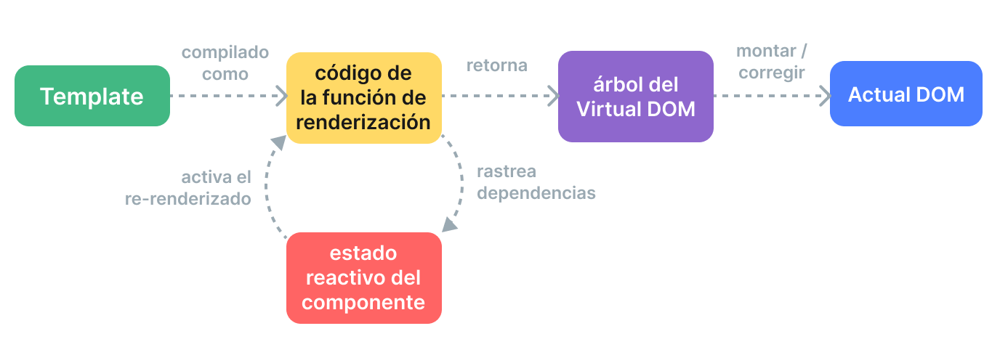

# Mecanismo de Renderizado {#rendering-mechanism}

¿Cómo toma Vue una plantilla y la convierte en nodos DOM reales? ¿Cómo actualiza Vue esos nodos DOM de manera eficiente? Aquí intentaremos arrojar luz sobre estas preguntas adentrándonos en el mecanismo de renderizado interno de Vue.

## DOM Virtual {#virtual-dom}

Probablemente hayas oído hablar del término "DOM virtual", en el que se basa el sistema de renderizado de Vue.

El DOM virtual (VDOM) es un concepto de programación en el que se mantiene en memoria una representación ideal, o “virtual”, de una interfaz de usuario y se sincroniza con el DOM “real”. El concepto fue pionero en [React](https://reactjs.org/) y ha sido adoptado en muchos otros frameworks con diferentes implementaciones, incluido Vue.

El DOM virtual es más un patrón que una tecnología específica, por lo que no existe una implementación canónica única. Podemos ilustrar la idea utilizando un ejemplo simple:

```js
const vnode = {
  type: 'div',
  props: {
    id: 'hello'
  },
  children: [
    /* more vnodes */
  ]
}
```

Aquí, `vnode` es un objeto JavaScript simple (un "nodo virtual") que representa un elemento `<div>`. Contiene toda la información que necesitamos para crear el elemento real. También contiene más vnodes hijos, lo que lo convierte en la raíz de un árbol DOM virtual.

Un renderizador en tiempo de ejecución puede recorrer un árbol DOM virtual y construir un árbol DOM real a partir de él. Este proceso se llama **montaje**.

Si tenemos dos copias de árboles DOM virtuales, el renderizador también puede recorrer y comparar los dos árboles, averiguando las diferencias y aplicando esos cambios al DOM real. Este proceso se llama **parcheado**, también conocido como "diffing" o "reconciliación".

El principal beneficio del DOM virtual es que le da al desarrollador la capacidad de crear, inspeccionar y componer estructuras de interfaz de usuario deseadas de forma programática y declarativa, dejando la manipulación directa del DOM al renderizador.

## Pipeline de Renderizado {#render-pipeline}

A un alto nivel, esto es lo que sucede cuando se monta un componente Vue:

1.  **Compilación**: Las plantillas de Vue se compilan en **funciones de renderizado**: funciones que devuelven árboles DOM virtuales. Este paso se puede realizar tanto de forma anticipada mediante un paso de compilación, como sobre la marcha utilizando el compilador en tiempo de ejecución.

2.  **Montaje**: El renderizador en tiempo de ejecución invoca las funciones de renderizado, recorre el árbol DOM virtual devuelto y crea nodos DOM reales basados en él. Este paso se realiza como un [efecto reactivo](./reactivity-in-depth), por lo que rastrea todas las dependencias reactivas que se utilizaron.

3.  **Parcheado**: Cuando una dependencia utilizada durante el montaje cambia, el efecto se vuelve a ejecutar. Esta vez, se crea un nuevo árbol DOM virtual actualizado. El renderizador en tiempo de ejecución recorre el nuevo árbol, lo compara con el anterior y aplica las actualizaciones necesarias al DOM real.



<!-- https://www.figma.com/file/elViLsnxGJ9lsQVsuhwqxM/Rendering-Mechanism -->

## Plantillas vs. Funciones de Renderizado {#templates-vs-render-functions}

Las plantillas de Vue se compilan en funciones de renderizado de DOM virtual. Vue también proporciona APIs que nos permiten omitir el paso de compilación de plantillas y crear directamente funciones de renderizado. Las funciones de renderizado son más flexibles que las plantillas cuando se trata de lógica altamente dinámica, porque puedes trabajar con vnodes usando todo el poder de JavaScript.

Entonces, ¿por qué Vue recomienda las plantillas por defecto? Hay varias razones:

1.  Las plantillas están más cerca del HTML real. Esto facilita la reutilización de fragmentos de HTML existentes, la aplicación de las mejores prácticas de accesibilidad, el estilo con CSS y que los diseñadores las entiendan y modifiquen.

2.  Las plantillas son más fáciles de analizar estáticamente debido a su sintaxis más determinista. Esto permite que el compilador de plantillas de Vue aplique muchas optimizaciones en tiempo de compilación para mejorar el rendimiento del DOM virtual (lo cual discutiremos a continuación).

En la práctica, las plantillas son suficientes para la mayoría de los casos de uso en las aplicaciones. Las funciones de renderizado se utilizan típicamente solo en componentes reutilizables que necesitan manejar lógica de renderizado altamente dinámica. El uso de funciones de renderizado se discute con más detalle en [Funciones de Renderizado y JSX](./render-function).

## DOM Virtual con Información del Compilador {#compiler-informed-virtual-dom}

La implementación del DOM virtual en React y la mayoría de las otras implementaciones de DOM virtual son puramente en tiempo de ejecución: el algoritmo de reconciliación no puede hacer ninguna suposición sobre el árbol DOM virtual entrante, por lo que tiene que recorrer completamente el árbol y comparar las `props` de cada `vnode` para asegurar la corrección. Además, incluso si una parte del árbol nunca cambia, siempre se crean nuevos `vnodes` para ellas en cada nuevo renderizado, lo que resulta en una presión de memoria innecesaria. Este es uno de los aspectos más criticados del DOM virtual: el proceso de reconciliación algo de fuerza bruta sacrifica la eficiencia a cambio de la declarativad y la corrección.

Pero no tiene por qué ser así. En Vue, el framework controla tanto el compilador como el tiempo de ejecución. Esto nos permite implementar muchas optimizaciones en tiempo de compilación de las que solo un renderizador estrechamente acoplado puede aprovechar. El compilador puede analizar estáticamente la plantilla y dejar pistas en el código generado para que el tiempo de ejecución pueda tomar atajos siempre que sea posible. Al mismo tiempo, todavía preservamos la capacidad para que el usuario descienda a la capa de la función de renderizado para un control más directo en casos extremos. A este enfoque híbrido lo llamamos **DOM Virtual con Información del Compilador**.

A continuación, discutiremos algunas de las principales optimizaciones realizadas por el compilador de plantillas de Vue para mejorar el rendimiento en tiempo de ejecución del DOM virtual.

### Caché Estática {#cache-static}

Con bastante frecuencia habrá partes en una plantilla que no contengan ningún enlace dinámico:

```vue-html{2-3}
<div>
  <div>foo</div> <!-- cached -->
  <div>bar</div> <!-- cached -->
  <div>{{ dynamic }}</div>
</div>
```

[Inspeccionar en Template Explorer](https://template-explorer.vuejs.org/#eyJzcmMiOiI8ZGl2PlxuICA8ZGl2PmZvbzwvZGl2PiA8IS0tIGNhY2hlZCAtLT5cbiAgPGRpdj5iYXI8L2Rpdj4gPCEtLSBjYWNoZWQgLS0+XG4gIDxkaXY+e3sgZHluYW1pYyB9fTwvZGl2PlxuPC9kaXY+XG4iLCJvcHRpb25zIjp7ImhvaXN0U3RhdGljIjp0cnVlfX0=)

Los `divs` `foo` y `bar` son estáticos: volver a crear `vnodes` y compararlos en cada nuevo renderizado es innecesario. El renderizador crea estos `vnodes` durante el renderizado inicial, los almacena en caché y reutiliza los mismos `vnodes` para cada renderizado posterior. El renderizador también es capaz de omitir completamente su comparación cuando nota que el `vnode` antiguo y el `vnode` nuevo son el mismo.

Además, cuando hay suficientes elementos estáticos consecutivos, se condensarán en un único "vnode estático" que contiene la cadena HTML simple para todos estos nodos ([Ejemplo](https://template-explorer.vuejs.org/#eyJzcmMiOiI8ZGl2PlxuICA8ZGl2IGNsYXNzPVwiZm9vXCI+Zm9vPC9kaXY+XG4gIDxkaXYgY2xhc3M9XCJmb29cIj5mb288L2Rpdj4XG4gIDxkaXYgY2xhc3M9XCJmb29cIj5mb288L2Rpdj5cbiAgPGRpdj5jbGFzcz1cImZvb1wiPmZvbjwvcGl2PjpcbiAgPGRpdj5jbGFzcz1cImZvb1wiPmZvbjwvcGl2PjpcbiAgPGRpdj57eyBkeW5hbWljIH19PC9kaXY+XG48L2Rpdj4iLCJzc3IiOmZhbHNlLCJvcHRpb25zIjp7ImhvaXN0U3RhdGljIjp0cnVlfX0=)). Estos `vnodes` estáticos se montan estableciendo directamente `innerHTML`.

### Banderas de Parcheo {#patch-flags}

Para un solo elemento con enlaces dinámicos, también podemos inferir mucha información de él en tiempo de compilación:

```vue-html
<!-- class binding only -->
<div :class="{ active }"></div>

<!-- id and value bindings only -->
<input :id="id" :value="value">

<!-- text children only -->
<div>{{ dynamic }}</div>
```

[Inspeccionar en Template Explorer](https://template-explorer.vuejs.org/#eyJzcmMiOiI8ZGl2IDpjbGFzcz1cInsgYWN0aXZlIH1cIj48L2Rpdj5cblxuPGlucHV0IDppZD1cImlkXCIgOnZhbHVlPVwidmFsdWVcIj5cblxuPGRpdj57eyBkeW5hbWljIH19PC9kaXY+Iiwib3B0aW9ucyI6e319)

Al generar el código de la función de renderizado para estos elementos, Vue codifica el tipo de actualización que cada uno de ellos necesita directamente en la llamada de creación de `vnode`:

```js{3}
createElementVNode("div", {
  class: _normalizeClass({ active: _ctx.active })
}, null, 2 /* CLASS */)
```

El último argumento, `2`, es una [bandera de parcheo](https://github.com/vuejs/core/blob/main/packages/shared/src/patchFlags.ts). Un elemento puede tener múltiples banderas de parcheo, que se fusionarán en un solo número. El renderizador en tiempo de ejecución puede entonces verificar las banderas usando [operaciones bit a bit](https://en.wikipedia.org/wiki/Bitwise_operation) para determinar si necesita realizar cierto trabajo:

```js
if (vnode.patchFlag & PatchFlags.CLASS /* 2 */) {
  // update the element's class
}
```

Las verificaciones bit a bit son extremadamente rápidas. Con las banderas de parcheo, Vue es capaz de realizar la menor cantidad de trabajo necesario al actualizar elementos con enlaces dinámicos.

Vue también codifica el tipo de hijos que tiene un `vnode`. Por ejemplo, una plantilla que tiene múltiples nodos raíz se representa como un fragmento. En la mayoría de los casos, sabemos con seguridad que el orden de estos nodos raíz nunca cambiará, por lo que esta información también puede proporcionarse al tiempo de ejecución como una bandera de parcheo:

```js{4}
export function render() {
  return (_openBlock(), _createElementBlock(_Fragment, null, [
    /* children */
  ], 64 /* STABLE_FRAGMENT */))
}
```

El tiempo de ejecución puede, por lo tanto, omitir completamente la reconciliación del orden de los hijos para el fragmento raíz.

### Aplanamiento de Árbol {#tree-flattening}

Si volvemos a examinar el código generado del ejemplo anterior, notarás que la raíz del árbol DOM virtual devuelto se crea utilizando una llamada especial `createElementBlock()`:

```js{2}
export function render() {
  return (_openBlock(), _createElementBlock(_Fragment, null, [
    /* children */
  ], 64 /* STABLE_FRAGMENT */))
}
```

Conceptualmente, un "bloque" es una parte de la plantilla que tiene una estructura interna estable. En este caso, toda la plantilla tiene un único bloque porque no contiene directivas estructurales como `v-if` y `v-for`.

Cada bloque rastrea cualquier nodo descendiente (no solo hijos directos) que tenga banderas de parcheo. Por ejemplo:

```vue-html{3,5}
<div> <!-- root block -->
  <div>...</div>         <!-- no rastreado -->
  <div :id="id"></div>   <!-- rastreado -->
  <div>                  <!-- no rastreado -->
    <div>{{ bar }}</div> <!-- rastreado -->
  </div>
</div>
```

El resultado es un array aplanado que contiene solo los nodos descendientes dinámicos:

```
div (block root)
- div con enlace :id
- div con enlace {{ bar }}
```

Cuando este componente necesita volver a renderizarse, solo necesita recorrer el árbol aplanado en lugar del árbol completo. Esto se llama **Aplanamiento de Árbol**, y reduce en gran medida el número de nodos que deben ser recorridos durante la reconciliación del DOM virtual. Cualquier parte estática de la plantilla se omite efectivamente.

Las directivas `v-if` y `v-for` crearán nuevos nodos de bloque:

```vue-html
<div> <!-- root block -->
  <div>
    <div v-if> <!-- if block -->
      ...
    </div>
  </div>
</div>
```

Un bloque hijo se rastrea dentro del array de descendientes dinámicos del bloque padre. Esto mantiene una estructura estable para el bloque padre.

### Impacto en la Hidratación SSR {#impact-on-ssr-hydration}

Tanto las banderas de parcheo como el aplanamiento de árbol también mejoran enormemente el rendimiento de la [Hidratación SSR](/guide/scaling-up/ssr#client-hydration) de Vue:

-   La hidratación de un solo elemento puede tomar rutas rápidas basadas en la bandera de parcheo del `vnode` correspondiente.

-   Solo los nodos de bloque y sus descendientes dinámicos necesitan ser recorridos durante la hidratación, logrando efectivamente una hidratación parcial a nivel de plantilla.